# Monte Carlo manager refactoring UML

This diagram describes the target architecture from
`monte_carlo_manager_refactoring_plan.md` and records the file split already
implemented for the active managers. The file nodes are shown as stereotyped
classes; a dashed dependency from a file to a class means that the file
defines or owns that class. The abstract core/backend nodes remain the next
extraction step, while the component `.hpp` nodes show the concrete split that is now in
the tree.

```mermaid
classDiagram
    direction LR

    class ManagerFactory_hpp <<file>>
    class Manager3D_hpp <<file>>
    class SerialManager_hpp <<file>>
    class SerialLifecycle_hpp <<file>>
    class SerialTransport_hpp <<file>>
    class TwoSidedManager_hpp <<file>>
    class TwoSidedLifecycle_hpp <<file>>
    class TwoSidedTransport_hpp <<file>>
    class RDMAManager_hpp <<file>>
    class RDMAOperations_hpp <<file>>
    class RDMATransport_hpp <<file>>
    class RDMAStepLifecycle_hpp <<file>>
    class RDMARankLifecycle_hpp <<file>>
    class RDMASendProtocol_hpp <<file>>
    class RegisteredSendBuffer_hpp <<file>>
    class ParticleQueue_hpp <<file>>
    class ParticleInitialization_hpp <<file>>
    class StepState_hpp <<file>>
    class Tracker_hpp <<file>>
    class TransportCore_hpp <<file>>
    class LocalExecutor_hpp <<file>>

    class MonteCarloManagerFactory {
        +Create(...)
        +ManagerType
    }

    class MonteCarloManager3D {
        <<interface>>
        +step(...)
        +GetCellsStepsCounters()
    }

    class MonteCarloManagerSerial3D
    class TwoSidedMonteCarloManager3D
    class RDMAMonteCarloManager3D

    class MonteCarloManagerSerial {
        +step(...)
    }
    class TwoSidedMonteCarloManager {
        +step(...)
    }
    class RDMAMonteCarloManager {
        +step(...)
    }

    class MonteCarloManagerCore {
        <<template: Store, Backend, Executor>>
        +step(...)
        +HandleAll(...)
    }
    class MonteCarloStepLifecycle {
        +beginStep(...)
        +runTransport(...)
        +finishStep(...)
    }
    class MonteCarloTransportKernel {
        +process(...)
        +processUntilLeavingLocalOwnership(...)
    }
    class MonteCarloStepState {
        +remaining
        +leavingCount
        +transport outcome
    }
    class MonteCarloTracker {
        +Reset()
        +ReportParticle(...)
        +GetTrackParticleRoute(...)
    }
    class MonteCarloParticleInitializer {
        +Initialize(...)
        +InitializeStore(...)
    }
    class MonteCarloTransportCore {
        +HandleAll(...)
    }
    class HostLocalTransportExecutor {
        +Execute(...)
    }
    class ParticleQueue {
        +Append(...)
        +Consume()
    }
    class RegisteredSendBuffer {
        +Append(...)
        +SourceLkey(...)
    }
    class MonteCarloMetrics {
        +particle counts
        +cell counters
        +timings
    }

    class ParticleStore {
        <<interface / static contract>>
        +empty()
        +size()
        +acquireBatch(...)
        +commit(...)
        +append(...)
    }
    class LocalParticleQueue {
        +head
        +tail
        +append(...)
        +consume()
        +detachBatch(...)
    }
    class VectorParticleStore {
        +append(...)
        +remove(...)
        +acquireBatch(...)
    }
    class RDMAParticleStore {
        +acquireFromRankHandler(...)
        +detachArrivals(...)
        +appendLocal(...)
    }

    class TransportBackend {
        <<interface / static contract>>
        +beginStep(...)
        +commit(...)
        +progress()
        +localWorkDone()
        +noPendingWork()
    }
    class LocalBackend {
        +commit(...)
        +noPendingWork()
    }
    class TwoSidedMPIBackend {
        +commit(...)
        +progress()
    }
    class RDMABackend {
        +commit(...)
        +progress()
        +flushTransfers()
    }
    class TerminationController {
        <<interface / policy>>
        +initialize(count)
        +decrease(count)
        +verify()
        +done()
    }
    class RDMAReallocationController {
        +request(...)
        +progress()
        +retryPending()
    }

    class LocalTransportExecutor {
        <<interface / static contract>>
        +execute(batch, context)
    }
    class TransportBatch {
        +particles
        +ownership token
    }
    class TransportCompletion {
        +particle
        +physics result
        +deviceErrorTiming
    }
    class ExecutorContext {
        +fullDt
        +grid/device views
        +progress callback
    }
    class BatchResult {
        +completions
        +survivors
        +metrics
    }
    class HostLocalTransportExecutor {
        +execute(batch, callback)
    }
    class GpuTransportPolicy {
        +ingest(...)
        +advanceWave(...)
        +collectCompletions(...)
    }
    class GpuTransportExecutor {
        <<interface>>
        +ingest(...)
        +advanceWave(...)
    }
    class KokkosTransportExecutor {
        +ingest(...)
        +advanceWave(...)
    }

    class RankHandler2 {
        +head
        +tail
        +LocalSize()
        +DetachLocalParticles(...)
        +AppendLocalParticles(...)
        +TransferParticles(...)
    }
    class ReallocationAgent {
        +RequestReallocation(...)
        +ProgressAsyncReallocations()
    }
    class BuffersManager {
        +Add(...)
        +HandleIncomingOutcoming()
    }
    class AmountManager {
        +Initialize(...)
        +Decrease(...)
        +Progress()
        +Verify(...)
    }

    %% Public construction and adapters
    MonteCarloManagerFactory ..> MonteCarloManagerSerial : creates
    MonteCarloManagerFactory ..> TwoSidedMonteCarloManager : creates
    MonteCarloManagerFactory ..> RDMAMonteCarloManager : creates

    %% Concrete manager-file split (implemented)
    SerialManager_hpp ..> SerialLifecycle_hpp : includes step lifecycle
    SerialManager_hpp ..> SerialTransport_hpp : includes HandleAll
    TwoSidedManager_hpp ..> TwoSidedLifecycle_hpp : includes step lifecycle
    TwoSidedManager_hpp ..> TwoSidedTransport_hpp : includes HandleAll
    RDMAManager_hpp ..> RDMATransport_hpp : includes transport/GPU loop
    RDMAManager_hpp ..> RDMAOperations_hpp : includes construction/transfers
    RDMAManager_hpp ..> RDMAStepLifecycle_hpp : includes step()
    RDMAManager_hpp ..> RDMARankLifecycle_hpp : includes handler lifecycle
    RDMAManager_hpp ..> RDMASendProtocol_hpp : includes send protocol
    RDMAManager_hpp ..> RegisteredSendBuffer_hpp : composes buffer type
    SerialManager_hpp ..> ParticleQueue_hpp : stores particles
    SerialManager_hpp ..> ParticleInitialization_hpp : initializes particles
    SerialManager_hpp ..> StepState_hpp : uses step state
    SerialManager_hpp ..> Tracker_hpp : uses tracker
    SerialManager_hpp ..> TransportCore_hpp : uses shared batch driver
    SerialManager_hpp ..> LocalExecutor_hpp : selects host executor
    TwoSidedManager_hpp ..> ParticleInitialization_hpp : initializes particles
    TwoSidedManager_hpp ..> StepState_hpp : uses step state
    TwoSidedManager_hpp ..> Tracker_hpp : uses tracker
    RDMAManager_hpp ..> ParticleInitialization_hpp : initializes particles
    RDMAManager_hpp ..> StepState_hpp : uses step state
    RDMAManager_hpp ..> Tracker_hpp : uses tracker
    RDMAManager_hpp ..> TransportCore_hpp : uses host batch driver
    RDMAManager_hpp ..> LocalExecutor_hpp : selects host executor

    MonteCarloManagerSerial3D ..|> MonteCarloManager3D
    TwoSidedMonteCarloManager3D ..|> MonteCarloManager3D
    RDMAMonteCarloManager3D ..|> MonteCarloManager3D
    MonteCarloManagerSerial3D --|> MonteCarloManagerSerial
    TwoSidedMonteCarloManager3D --|> TwoSidedMonteCarloManager
    RDMAMonteCarloManager3D --|> RDMAMonteCarloManager

    MonteCarloManagerSerial *-- MonteCarloManagerCore
    TwoSidedMonteCarloManager *-- MonteCarloManagerCore
    RDMAMonteCarloManager *-- MonteCarloManagerCore

    %% Core composition
    MonteCarloManagerCore *-- MonteCarloStepLifecycle
    MonteCarloManagerCore *-- MonteCarloTransportKernel
    MonteCarloManagerCore *-- MonteCarloStepState
    MonteCarloManagerCore *-- MonteCarloTracker
    MonteCarloManagerCore *-- MonteCarloMetrics
    MonteCarloManagerCore o-- ParticleStore
    MonteCarloManagerCore o-- TransportBackend
    MonteCarloManagerCore o-- LocalTransportExecutor
    MonteCarloManagerCore ..> TransportBatch : acquires
    MonteCarloManagerCore ..> BatchResult : consumes

    MonteCarloStepLifecycle ..> MonteCarloStepState : initializes/finalizes
    MonteCarloStepLifecycle ..> ParticleStore : loads/initializes particles
    MonteCarloStepLifecycle ..> TransportBackend : starts/ends termination
    MonteCarloManagerCore ..> MonteCarloTransportKernel : shared HandleAll driver
    MonteCarloTransportKernel ..> MonteCarloStepState : writes outcomes
    MonteCarloTransportKernel ..> MonteCarloTracker : reports routes
    MonteCarloTransportKernel ..> MonteCarloMetrics : increments counters

    %% Storage implementations
    LocalParticleQueue ..|> ParticleStore
    VectorParticleStore ..|> ParticleStore
    RDMAParticleStore ..|> ParticleStore

    %% Backend implementations
    LocalBackend ..|> TransportBackend
    TwoSidedMPIBackend ..|> TransportBackend
    RDMABackend ..|> TransportBackend
    LocalBackend *-- TerminationController
    TwoSidedMPIBackend *-- TerminationController
    RDMABackend *-- TerminationController
    RDMABackend *-- RDMAReallocationController

    TwoSidedMPIBackend *-- BuffersManager
    TwoSidedMPIBackend *-- AmountManager
    RDMABackend *-- RankHandler2
    RDMABackend *-- ReallocationAgent

    %% Executor implementations
    HostLocalTransportExecutor ..|> LocalTransportExecutor
    LocalTransportExecutor ..> TransportBatch : receives
    LocalTransportExecutor ..> ExecutorContext : receives
    LocalTransportExecutor ..> BatchResult : returns
    BatchResult *-- TransportCompletion
    TransportCompletion ..> MonteCarloTransportKernel : processed by core
    GpuTransportPolicy o-- GpuTransportExecutor
    KokkosTransportExecutor ..|> GpuTransportExecutor
    GpuTransportPolicy ..> MonteCarloTransportKernel : completion events
    GpuTransportPolicy ..> TransportBackend : never calls directly

    %% File ownership / definitions
    ManagerFactory_hpp ..> MonteCarloManagerFactory : defines
    Manager3D_hpp ..> MonteCarloManager3D : defines
    Manager3D_hpp ..> MonteCarloManagerSerial3D : defines
    Manager3D_hpp ..> TwoSidedMonteCarloManager3D : defines
    Manager3D_hpp ..> RDMAMonteCarloManager3D : defines
    SerialManager_hpp ..> MonteCarloManagerSerial : defines
    TwoSidedManager_hpp ..> TwoSidedMonteCarloManager : defines
    RDMAManager_hpp ..> RDMAMonteCarloManager : defines

    class Core_hpp <<file>>
    class Lifecycle_hpp <<file>>
    class Kernel_hpp <<file>>
    class State_hpp <<file>>
    class Metrics_hpp <<file>>
    class Store_hpp <<file>>
    class Queue_hpp <<file>>
    class Backend_hpp <<file>>
    class LocalBackend_hpp <<file>>
    class TwoSidedBackend_hpp <<file>>
    class RDMAStore_hpp <<file>>
    class RDMABackend_hpp <<file>>
    class Executor_hpp <<file>>
    class GpuPolicy_hpp <<file>>
    class KokkosExecutor_hpp <<file>>

    Core_hpp ..> MonteCarloManagerCore : defines
    Lifecycle_hpp ..> MonteCarloStepLifecycle : defines
    Kernel_hpp ..> MonteCarloTransportKernel : defines
    State_hpp ..> MonteCarloStepState : defines
    Tracker_hpp ..> MonteCarloTracker : defines
    Metrics_hpp ..> MonteCarloMetrics : defines
    Store_hpp ..> ParticleStore : defines
    Queue_hpp ..> LocalParticleQueue : defines
    ParticleInitialization_hpp ..> MonteCarloParticleInitializer : defines
    TransportCore_hpp ..> MonteCarloTransportCore : defines
    LocalExecutor_hpp ..> HostLocalTransportExecutor : defines
    ParticleQueue_hpp ..> ParticleQueue : defines
    RegisteredSendBuffer_hpp ..> RegisteredSendBuffer : defines
    Backend_hpp ..> TransportBackend : defines
    LocalBackend_hpp ..> LocalBackend : defines
    TwoSidedBackend_hpp ..> TwoSidedMPIBackend : defines
    RDMAStore_hpp ..> RDMAParticleStore : defines
    RDMABackend_hpp ..> RDMABackend : defines
    Executor_hpp ..> LocalTransportExecutor : defines
    GpuPolicy_hpp ..> GpuTransportPolicy : defines
    KokkosExecutor_hpp ..> KokkosTransportExecutor : defines
```

The short file aliases in the diagram map to these paths:

- `ManagerFactory_hpp` — `source/monte/manager/MonteCarloManagerFactory.hpp`
- `Manager3D_hpp` — `source/3D/monte/MonteCarloManager3D.hpp/.cpp`
- `SerialManager_hpp` — `source/monte/manager/MonteCarloManagerSerial.hpp`
- `SerialLifecycle_hpp` — `source/monte/manager/SerialMonteCarloLifecycle.hpp`
- `SerialTransport_hpp` — `source/monte/manager/SerialMonteCarloTransport.hpp`
- `TwoSidedManager_hpp` — `source/monte/manager/parallel/TwoSidedMonteCarloManager.hpp`
- `TwoSidedLifecycle_hpp` — `source/monte/manager/parallel/TwoSidedMonteCarloLifecycle.hpp`
- `TwoSidedTransport_hpp` — `source/monte/manager/parallel/TwoSidedMonteCarloTransport.hpp`
- `RDMAManager_hpp` — `source/monte/manager/parallel/RDMAMonteCarloManager.hpp`
- `RDMAOperations_hpp` — `source/monte/manager/parallel/RDMAManagerOperations.hpp`
- `RDMATransport_hpp` — `source/monte/manager/parallel/RDMAMonteCarloTransport.hpp`
- `RDMAStepLifecycle_hpp` — `source/monte/manager/parallel/RDMAStepLifecycle.hpp`
- `RDMARankLifecycle_hpp` — `source/monte/manager/parallel/RDMARankHandlerLifecycle.hpp`
- `RDMASendProtocol_hpp` — `source/monte/manager/parallel/RDMASendBufferProtocol.hpp`
- `RegisteredSendBuffer_hpp` — `source/monte/manager/parallel/RegisteredSendBuffer.hpp`

The implemented shared files are `ParticleQueue.hpp`,
`MonteCarloParticleInitialization.hpp`, `MonteCarloStepState.hpp`,
`MonteCarloTracker.hpp`, `MonteCarloTransportCore.hpp`, and
`LocalTransportExecutor.hpp`. `ParticleQueue` is the concrete first-slice
name; it is the planned `LocalParticleQueue` role in the diagram. The
remaining abstract `*_hpp` nodes represent the next core/backend extraction.

## Reading the diagram

- `MonteCarloTransportCore::HandleAll()` is the implemented shared driver. It
  obtains work from a store, invokes `HostLocalTransportExecutor::Execute`,
  and leaves event semantics in the manager callback. The planned
  `MonteCarloManagerCore::HandleAll()` will extend this seam with backend
  progress and outcome commits.
- `MonteCarloManagerCore` is parameterized by `ParticleStore`,
  `TransportBackend`, and `LocalTransportExecutor`. The Serial, TwoSided, and
  RDMA managers are different compositions of the same algorithm, not three
  copies of the algorithm.
- `TransportBatch` is the ownership boundary. The executor returns a
  `BatchResult` containing `TransportCompletion` records; the core owns the
  subsequent boundary, tracking, removal, and communication decisions.
- `LocalParticleQueue`, `VectorParticleStore`, and `RDMAParticleStore` hide
  the incompatible Serial, TwoSided, and RDMA storage layouts.
- `TransportBackend` owns communication and distributed completion. The core
  never calls `BuffersManager`, `RankHandler2`, `AmountManager`, or
  `ReallocationAgent` directly.
- `GpuTransportPolicy` shares the local execution boundary with all managers,
  but returns completion events to the host kernel. It does not perform MPI or
  RDMA operations.
- The `<<file>>` nodes show the intended header boundaries. The concrete
  classes may remain templates and therefore still have their definitions in
  headers. The former `.inl` files are now ordinary `.hpp` component headers;
  non-template runtime implementations remain `.cpp` files.
