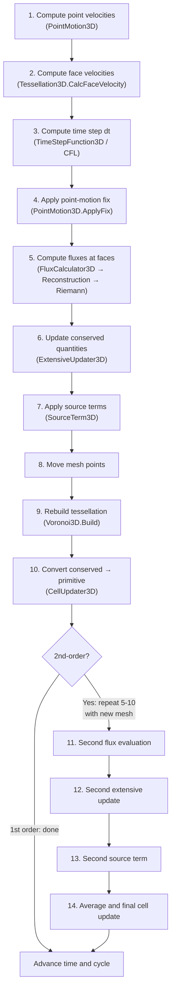

# Code Architecture

RICH is a modular astrophysical hydrodynamics code built around pluggable abstract interfaces. Every aspect of the simulation -- mesh motion, flux computation, thermodynamics, external forces -- is controlled by a separate abstract class that you plug into the central simulation object, `HDSim3D`. This page is a comprehensive reference for the architecture.

## Table of Contents

- [HDSim3D -- The Central Simulation Object](#hdsim3d----the-central-simulation-object)
- [Data Model](#data-model)
- [Abstract Interfaces and Implementations](#abstract-interfaces-and-implementations)
  - [Tessellation3D](#1-tessellation3d----the-mesh)
  - [EquationOfState](#2-equationofstate----thermodynamics)
  - [PointMotion3D](#3-pointmotion3d----mesh-motion-strategy)
  - [TimeStepFunction3D](#4-timestepfunction3d----time-step-control)
  - [SpatialReconstruction3D](#5-spatialreconstruction3d----interpolation)
  - [FluxCalculator3D](#6-fluxcalculator3d----face-fluxes)
  - [RiemannSolver3D](#7-riemannsolver3d----riemann-problem)
  - [CellUpdater3D](#8-cellupdater3d----conserved-to-primitive)
  - [ExtensiveUpdater3D](#9-extensiveupdater3d----flux-integration)
  - [SourceTerm3D](#10-sourceterm3d----external-forces)
  - [RadiationDriver](#11-radiationdriver----radiation-transport)
  - [AMR3D](#12-amr3d----adaptive-mesh-refinement)
- [Data Flow: What Happens in a Time Step](#data-flow-what-happens-in-a-time-step)
- [The Condition-Action Pattern](#the-condition-action-pattern)
- [How to Build an HDSim3D: Practical Checklist](#how-to-build-an-hdsim3d-practical-checklist)
- [Directory Layout](#directory-layout)
- [Compile-Time Configuration](#compile-time-configuration)
- [Error Handling](#error-handling)

---

## HDSim3D -- The Central Simulation Object

`HDSim3D` is the main simulation driver. It owns all simulation state (cells, conserved variables, time) and references the pluggable components that define how the simulation evolves.

**Source:** `source/newtonian/three_dimensional/hdsim_3d.hpp`

### Constructor

```cpp
HDSim3D(Tessellation3D& tess,
        const vector<ComputationalCell3D>& cells,
        const EquationOfState& eos,
        const PointMotion3D& pm,
        const TimeStepFunction3D& tsc,
        const FluxCalculator3D& fc,
        const CellUpdater3D& cu,
        const ExtensiveUpdater3D& eu,
        const SourceTerm3D& source,
        const pair<vector<string>, vector<string>>& tsn,
        bool SR = false,
        bool new_start = true);
```

Every parameter except the last two is **required**. Each one plugs in a different aspect of the physics or numerics:

| Parameter | Type | What It Controls |
|-----------|------|-----------------|
| `tess` | `Tessellation3D&` | The computational mesh. Owns the geometry (cell volumes, face areas, neighbors). |
| `cells` | `vector<ComputationalCell3D>` | Initial primitive variables for every cell (density, pressure, velocity, etc.). |
| `eos` | `const EquationOfState&` | Thermodynamic relations: converts between density/pressure/energy/sound-speed. |
| `pm` | `const PointMotion3D&` | Mesh motion strategy: how mesh-generating points move each time step. |
| `tsc` | `const TimeStepFunction3D&` | Time step calculator: enforces CFL stability. |
| `fc` | `const FluxCalculator3D&` | Flux calculator: computes numerical fluxes at every cell interface. |
| `cu` | `const CellUpdater3D&` | Cell updater: converts conserved (extensive) variables back to primitives via the EOS. |
| `eu` | `const ExtensiveUpdater3D&` | Extensive updater: integrates fluxes into conserved variables. |
| `source` | `const SourceTerm3D&` | Source terms: external forces (gravity, radiation momentum, etc.). |
| `tsn` | `pair<vector<string>, vector<string>>` | Names of tracers (passive scalars) and stickers (boolean labels). |
| `SR` | `bool` | Enable special-relativistic mode (default: `false`). |
| `new_start` | `bool` | Whether to reinitialize cell IDs (default: `true`; set to `false` for restarts). |

### Internal State

| Member | Type | Purpose |
|--------|------|---------|
| `tess_` | `Tessellation3D&` | Reference to the mesh |
| `cells_` | `vector<ComputationalCell3D>` | Current primitive variables for all cells |
| `extensive_` | `vector<Conserved3D>` | Current conserved variables (mass, momentum, energy, tracers) |
| `eos_` | `const EquationOfState&` | Equation of state |
| `pm_` | `const PointMotion3D&` | Point motion strategy |
| `tsc_` | `const TimeStepFunction3D&` | Time step function |
| `fc_` | `const FluxCalculator3D&` | Flux calculator |
| `cu_` | `const CellUpdater3D&` | Cell updater |
| `eu_` | `const ExtensiveUpdater3D&` | Extensive updater |
| `source_` | `const SourceTerm3D&` | Source term |
| `pt_` | `ProgressTracker` | Tracks simulation time and cycle number |
| `dt_` | `double` | Current time step |
| `Max_ID_` | `size_t` | Maximum cell ID (for AMR) |

### Time Stepping Methods

| Method | Order | Description |
|--------|-------|-------------|
| `timeAdvance()` | 1st | Single evaluation: compute fluxes, apply sources, update cells once. |
| `timeAdvance2()` | 2nd | Heun-like predictor-corrector: two flux/source evaluations, average the results. |
| `timeAdvance3()` | 3rd | SSP (strong stability preserving) Runge-Kutta with three stages. |
| `timeAdvance32()` | 3rd | Variant SSP-RK3 scheme. |
| `timeAdvance33()` | 3rd | Another SSP-RK3 variant. |
| `timeAdvance4()` | 4th | SSP-RK4 with four stages. |

The most commonly used method is `timeAdvance2()`, which provides second-order accuracy in time at the cost of two flux evaluations per step.

### Tracers and Stickers

The `tsn` parameter is a pair of string vectors:

- **Tracers** (`tsn.first`): passive scalar fields advected with the fluid. Each cell carries a `tracers[]` array indexed by name. Used for tracking material composition, color fields, or any quantity that does not affect the dynamics.
- **Stickers** (`tsn.second`): boolean labels attached to cells. Each cell carries a `stickers[]` array. Used to tag cells for special treatment (e.g., mark a cell as "inner boundary" so the flux calculator applies different boundary conditions via the condition-action pattern).

---

## Data Model

### ComputationalCell3D (Primitive Variables)

**Source:** `source/newtonian/three_dimensional/computational_cell.hpp`

Each cell stores primitive (physically intuitive) variables:

| Field | Type | Meaning |
|-------|------|---------|
| `density` | `double` | Mass density |
| `pressure` | `double` | Thermal pressure |
| `internal_energy` | `double` | Specific internal energy (energy per unit mass) |
| `velocity` | `Vector3D` | Fluid velocity (vx, vy, vz) |
| `temperature` | `double` | Temperature (when EOS supports it) |
| `ID` | `size_t` | Unique cell identifier |
| `dt` | `double` | Per-cell time step |
| `cs` | `double` | Sound speed |
| `Erad` | `double` | Radiation energy per unit mass |
| `Eg` | `small_vector<double, ENERGY_GROUPS_NUM>` | Per-group radiation energy per unit mass |
| `Erad_dt` | `double` | Time-derivative of radiation energy per unit mass |
| `Erad_dt_dt` | `double` | Second time-derivative of radiation energy per unit mass |
| `tracers` | `array<double, MAX_TRACERS>` | Passive scalar tracers |
| `stickers` | `array<bool, MAX_STICKERS>` | Boolean cell labels |

Static members `tracerNames` and `stickerNames` map indices to human-readable names.

### Conserved3D (Conserved Variables)

**Source:** `source/newtonian/three_dimensional/conserved_3d.hpp`

Each cell also has a conserved representation (extensive quantities = primitive * volume):

| Field | Type | Meaning |
|-------|------|---------|
| `mass` | `double` | Total mass in cell |
| `momentum` | `Vector3D` | Total momentum |
| `energy` | `double` | Total energy (kinetic + thermal) |
| `internal_energy` | `double` | Total internal energy (dual-energy tracking) |
| `Erad` | `double` | Total radiation energy |
| `Eg` | `small_vector<double, ENERGY_GROUPS_NUM>` | Per-group radiation energy |
| `tracers` | `array<double, MAX_TRACERS>` | Tracer masses |

The relationship is: `Conserved = Primitive * Volume`. The simulation evolves conserved quantities (for conservation), then converts back to primitives via the `CellUpdater3D`.

### Slope3D (Spatial Gradients)

**Source:** `source/newtonian/three_dimensional/computational_cell.hpp`

```cpp
class Slope3D {
    ComputationalCell3D xderivative, yderivative, zderivative;
};
```

Stores x, y, z derivatives of all primitive fields. Used by `LinearGauss3D` for second-order spatial reconstruction.

---

## Abstract Interfaces and Implementations

RICH follows a strategy pattern: each physical or numerical aspect is represented by an abstract base class with pure virtual methods. You choose a concrete implementation and pass it to `HDSim3D`. The class hierarchy is summarized in this diagram:

```
HDSim3D
 |
 |-- Tessellation3D (mesh)
 |     \-- Voronoi3D
 |
 |-- EquationOfState (thermodynamics)
 |     |-- IdealGas
 |     |-- Tillotson / TillotsonOrg
 |     |-- OndrejEOS
 |     |-- MixedEOS
 |     \-- IdealGas_SR
 |
 |-- PointMotion3D (mesh motion)
 |     |-- Lagrangian3D
 |     |-- Eulerian3D
 |     |-- RoundCells3D (wraps another PointMotion3D)
 |     \-- LMotion3D
 |
 |-- TimeStepFunction3D (dt control)
 |     \-- CourantFriedrichsLewy
 |
 |-- FluxCalculator3D (face fluxes)
 |     \-- ConditionActionFlux1 (uses SpatialReconstruction3D + RiemannSolver3D)
 |           |-- SpatialReconstruction3D
 |           |     |-- PCM3D (1st order)
 |           |     \-- LinearGauss3D (2nd order)
 |           |-- Condition3D: IsBulkFace3D, IsBoundaryFace3D, RegularSpecialEdge3D, ...
 |           \-- Action3D: RegularFlux3D, RigidWallFlux3D, ZeroFlux3D, FreeFlowFlux3D, ...
 |                 \-- RiemannSolver3D
 |                       |-- Hllc3D
 |                       |-- Hllc3DEnergy
 |                       |-- LagrangianHLLC3D
 |                       \-- Hllc3D_SR
 |
 |-- CellUpdater3D (conserved -> primitive)
 |     \-- DefaultCellUpdater
 |
 |-- ExtensiveUpdater3D (flux integration)
 |     |-- DefaultExtensiveUpdater
 |     |-- ConditionExtensiveUpdater3D
 |     \-- LagrangianExtensiveUpdater3D
 |
 |-- SourceTerm3D (external forces)
 |     |-- ZeroForce3D
 |     |-- ConservativeForce3D (wraps Acceleration3D)
 |     |     |-- ConstantAcceleration3D
 |     |     |-- GravityAcceleration3D (tree-based self-gravity)
 |     |     |-- TDEGravity (tidal disruption)
 |     |     |-- QuadrupoleGravity3D
 |     |     \-- MonopoleSelfGravity3D
 |     |-- DiffusionForce (radiation pressure coupling)
 |     \-- SeveralSources3D (composite of multiple SourceTerm3D)
 |
 |-- [Optional] RadiationDriver
 |     |-- Diffusion (gray)
 |     \-- MultigroupDiffusion (multigroup + Compton)
 |
 \-- [Optional] AMR3D
       |-- CellsToRefine3D (user-defined refinement criteria)
       |-- CellsToRemove3D (user-defined removal criteria)
       |-- AMRCellUpdater3D: SimpleAMRCellUpdater3D, SimpleAMRCellUpdaterSR3D
       \-- AMRExtensiveUpdater3D: SimpleAMRExtensiveUpdater3D, SimpleAMRExtensiveUpdaterSR3D
```

Each interface is described in detail below.

---

### 1. Tessellation3D -- The Mesh

**Source:** `source/3D/tessellation/Tessellation3D.hpp`

**Purpose:** Represents the computational mesh. Provides geometric queries (cell volumes, face areas, neighbors, etc.) and handles mesh construction and reconstruction after point motion.

**Key pure virtual methods:**

| Method | Returns | Purpose |
|--------|---------|---------|
| `Build(points)` | `void` | Build mesh from a set of points (serial) |
| `GetPointNo()` | `size_t` | Number of local cells |
| `GetMeshPoint(index)` | `Vector3D` | Position of mesh-generating point |
| `GetVolume(index)` | `double` | Cell volume |
| `GetCellFaces(index)` | `vector<size_t>` | Face indices for a cell |
| `GetNeighbors(index)` | `vector<size_t>` | Neighbor cell indices |
| `GetArea(face)` | `double` | Face area |
| `GetCellCM(index)` | `Vector3D` | Cell center of mass |
| `CalcFaceVelocity(point_velocities)` | `vector<Vector3D>` | Compute face velocities from point velocities |
| `GetBoxCoordinates()` | `pair<Vector3D,Vector3D>` | Domain bounding box |
| `NearBoundary(index)` | `bool` | Whether cell touches domain boundary |
| `BoundaryFace(face)` | `bool` | Whether face is on the boundary |

**MPI-only methods:** `BuildParallel`, `PointInMyDomain`, `GetOwner`, `SetLoadBalancer`, `ShouldRebalance`, `GetDuplicatedPoints`, `GetSentProcs`, `GetGhostIndeces`, etc.

**Concrete implementation:**

| Class | Constructor | Description |
|-------|-------------|-------------|
| `Voronoi3D` | `Voronoi3D(Vector3D ll, Vector3D ur)` | 3D Voronoi tessellation inside the box `[ll, ur]`. The only mesh implementation in RICH. Uses exact geometric predicates and Delaunay3D internally. |

---

### 2. EquationOfState -- Thermodynamics

**Source:** `source/newtonian/common/equation_of_state.hpp`

**Purpose:** Defines thermodynamic relationships between density, pressure, internal energy, sound speed, entropy, and temperature. Every conversion the code needs goes through this interface.

**Pure virtual methods:**

| Method | Signature | Purpose |
|--------|-----------|---------|
| `dp2e` | `(density, pressure, tracers, tracer_names) -> double` | Pressure + density to specific internal energy |
| `de2p` | `(density, energy, tracers, tracer_names) -> double` | Energy + density to pressure |
| `de2c` | `(density, energy, ...) -> double` | Energy + density to sound speed |
| `dp2c` | `(density, pressure, ...) -> double` | Pressure + density to sound speed |
| `dp2s` | `(density, pressure, ...) -> double` | Pressure + density to entropy |
| `sd2p` | `(entropy, density, ...) -> double` | Entropy + density to pressure |

**Virtual methods with defaults (overridable):**

| Method | Purpose |
|--------|---------|
| `de2T(density, energy, ...)` | Internal energy to temperature |
| `dT2e(density, temperature, ...)` | Temperature to internal energy |
| `dT2cv(density, temperature, ...)` | Heat capacity at constant volume |

**Concrete implementations:**

| Class | Constructor | Use Case |
|-------|-------------|----------|
| `IdealGas` | `IdealGas(double gamma)` | Gamma-law ideal gas. Most common for basic hydro tests. Optionally supports a temperature law via extended constructor `IdealGas(gamma, f, beta, mu)` where \(e = f T^\beta \rho^{-\mu}\). |
| `Tillotson` | `Tillotson(a, b, A, B, rho0, E0, EIV, ECV, alpha, beta, negative_pressure, e_index)` | Tillotson EOS for high-energy-density physics (impacts, planetary science). Handles solid, compressed, and expanded states. |
| `TillotsonOrg` | `TillotsonOrg(a, b, A, B, rho0, E0, EIV, ECV, alpha, beta)` | Original Tillotson variant. |
| `OndrejEOS` | `OndrejEOS(density_file, P_file, cs_file, S_file, U_file, T_file, CV_file, lscale, mscale, tscale)` | Tabulated EOS from data files (Tomida et al. 2013). Reads tables of density vs. pressure/energy/temperature and interpolates. Scale parameters convert code units to CGS. |
| `MixedEOS` | `MixedEOS(vector<EquationOfState*>)` | Multi-material: selects EOS per cell based on a sticker index. Useful when different materials coexist in the same simulation. |
| `IdealGas_SR` | `IdealGas_SR(double gamma)` | Special-relativistic ideal gas (Synge EOS). |

---

### 3. PointMotion3D -- Mesh Motion Strategy

**Source:** `source/newtonian/three_dimensional/point_motion_3d.hpp`

**Purpose:** Determines how mesh-generating points move each time step. This is the key choice that makes the simulation Lagrangian, Eulerian, or ALE (Arbitrary Lagrangian-Eulerian).

**Pure virtual methods:**

| Method | Signature | Purpose |
|--------|-----------|---------|
| `operator()` | `(tess, cells, time, result)` | Compute velocity for each mesh point |

**Virtual methods with defaults:**

| Method | Default | Purpose |
|--------|---------|---------|
| `ApplyFix(tess, cells, time, dt, velocities)` | No-op | Post-correction to velocities (used by `RoundCells3D`) |
| `MovedPoints()` | Returns `true` | Whether points actually moved (optimization: skip tessellation rebuild if `false`) |

**Concrete implementations:**

| Class | Constructor | Behavior |
|-------|-------------|----------|
| `Lagrangian3D` | `Lagrangian3D()` | Sets point velocity = fluid velocity. The mesh moves with the fluid (Lagrangian). Minimizes advection errors but cells can become distorted. |
| `Eulerian3D` | `Eulerian3D()` | Sets point velocity = 0. The mesh is static (Eulerian). `MovedPoints()` returns `false`, so the tessellation is not rebuilt. |
| `RoundCells3D` | `RoundCells3D(pm, eos, chi=1.25, eta=0.02, cold=false, min_dw=0, dt_speed=0.01, no_move={})` | Wraps another `PointMotion3D` (typically `Lagrangian3D`) and adds a correction that steers mesh points toward cell centers of mass, keeping cells round. This is the ALE approach from Springel (2010) / Arepo. Parameters `chi` and `eta` control the strength of the correction. |
| `LMotion3D` | `LMotion3D(interp, eos, roundspeed, max_v)` | Lloyd's algorithm: moves points toward cell centroids. Produces a centroidal Voronoi tessellation with very regular cells. |

**How the choice affects the simulation:**

- **Lagrangian** (`Lagrangian3D`): Best for problems with large bulk motion (explosions, jets). Cells follow the flow, so there is zero advection error. But cells can become very elongated in shear flows.
- **Eulerian** (`Eulerian3D`): Best for steady-state problems on fixed grids. No mesh motion overhead. Maximum advection error.
- **ALE / RoundCells** (`RoundCells3D` wrapping `Lagrangian3D`): The recommended default. Gets most of the Lagrangian advantages while keeping cells round. The standard approach for RICH production simulations.

---

### 4. TimeStepFunction3D -- Time Step Control

**Source:** `source/newtonian/three_dimensional/time_step_function3D.hpp`

**Purpose:** Computes the maximum stable time step based on the CFL condition and source-term constraints.

**Pure virtual method:**

```cpp
double operator()(Tessellation3D const& tess,
                  vector<ComputationalCell3D> const& cells,
                  EquationOfState const& eos,
                  vector<Vector3D> const& face_velocities,
                  double time);
```

**Concrete implementation:**

| Class | Constructor | Description |
|-------|-------------|-------------|
| `CourantFriedrichsLewy` | `CourantFriedrichsLewy(double cfl, double SourceCFL, SourceTerm3D const& source, vector<string> no_calc = {}, bool debug = false)` | Standard CFL time step. |

**Parameters explained:**

| Parameter | Meaning |
|-----------|---------|
| `cfl` | Hydro CFL number (typically 0.2--0.3). The time step satisfies \(\Delta t \le \text{cfl} \cdot \Delta x / (c_s + |v|)\) for every cell. |
| `SourceCFL` | CFL number for source terms. Limits how fast source terms can change the state per step. Set to a large value (e.g. `1e10`) to effectively disable source-term limiting. |
| `source` | Reference to the `SourceTerm3D` -- used to query `SuggestInverseTimeStep()` for source-limited dt. |
| `no_calc` | Sticker names for cells excluded from the dt calculation (e.g., boundary sinks). |
| `debug` | Print per-cell dt info for debugging. |

---

### 5. SpatialReconstruction3D -- Interpolation

**Source:** `source/newtonian/three_dimensional/SpatialReconstruction3D.hpp`

**Purpose:** Computes face-centered values of primitive variables from cell-centered data. This determines the spatial order of accuracy of the scheme.

**Pure virtual methods:**

| Method | Purpose |
|--------|---------|
| `operator()(tess, cells, time, result)` | Compute left/right states at each face |
| `BuildSlopes(tess, cells, time)` | Compute cell gradients |
| `GetSlopes()` | Return the computed `vector<Slope3D>` |

**Concrete implementations:**

| Class | Constructor | Order | Description |
|-------|-------------|-------|-------------|
| `PCM3D` | `PCM3D(Ghost3D const& ghost)` | 1st | Piecewise Constant Method. Uses cell-center values directly at faces. Very diffusive but robust. |
| `LinearGauss3D` | `LinearGauss3D(eos, ghost, slf=true, delta_v=0.2, theta=0.5, delta_P=0.7, SR=false, calc_tracers={}, skip_key="", pressure_calc=true)` | 2nd | Linear reconstruction with Gauss-Green gradient estimation and slope limiting. The standard choice for production runs. |

**`LinearGauss3D` parameters:**

| Parameter | Meaning |
|-----------|---------|
| `eos` | Equation of state (needed for EOS-consistent limiting) |
| `ghost` | Ghost cell generator for boundary faces (e.g. `RigidWallGenerator3D`) |
| `slf` | Enable slope limiting (`true` by default) |
| `delta_v` | Velocity slope limiter parameter |
| `theta` | Generalized minmod parameter (0.5 = most diffusive, 1.0 = least) |
| `delta_P` | Pressure slope limiter parameter |

**Ghost3D implementations** (used by `LinearGauss3D`):

| Class | Purpose |
|-------|---------|
| `RigidWallGenerator3D` | Reflects velocity, copies other primitives. Models a solid wall. |
| `FreeFlowGenerator3D` | Copies all primitives. Models open boundaries. |

---

### 6. FluxCalculator3D -- Face Fluxes

**Source:** `source/newtonian/three_dimensional/flux_calculator_3d.hpp`

**Purpose:** Computes the numerical flux of conserved quantities across every face in the tessellation. This is where the Riemann solver is invoked.

**Pure virtual method:**

```cpp
vector<pair<ComputationalCell3D, ComputationalCell3D>>
operator()(fluxes, tess, edge_velocities, cells, extensives, eos, time, dt);
```

**Concrete implementation:**

| Class | Constructor | Description |
|-------|-------------|-------------|
| `ConditionActionFlux1` | `ConditionActionFlux1(vector<pair<Condition3D*, Action3D*>> sequence, SpatialReconstruction3D const& interp)` | Condition-action flux calculator. For each face, iterates through the sequence of (condition, action) pairs; the first condition that matches determines the action (flux computation) applied to that face. See [The Condition-Action Pattern](#the-condition-action-pattern). |

---

### 7. RiemannSolver3D -- Riemann Problem

**Source:** `source/newtonian/three_dimensional/RiemannSolver3D.hpp`

**Purpose:** Solves the Riemann problem at a cell interface given left and right states. Returns the inter-cell flux.

**Pure virtual method:**

```cpp
Conserved3D operator()(ComputationalCell3D const& left,
                       ComputationalCell3D const& right,
                       double velocity,  // face velocity (normal component)
                       EquationOfState const& eos,
                       Vector3D const& normaldir);
```

**Concrete implementations:**

| Class | Constructor | Description |
|-------|-------------|-------------|
| `Hllc3D` | `Hllc3D(double gamma = -1)` | HLLC (Harten-Lax-van Leer-Contact) approximate Riemann solver. The standard choice. Setting `gamma = -1` (default) uses the EOS for sound speed computation rather than a fixed gamma. |
| `Hllc3DEnergy` | `Hllc3DEnergy(double gamma = -1)` | HLLC variant with total-energy formulation instead of pressure-based. |
| `LagrangianHLLC3D` | `LagrangianHLLC3D(bool massflux = true)` | HLLC adapted for Lagrangian meshes. Includes a mass-flux correction term for moving interfaces. |
| `Hllc3D_SR` | `Hllc3D_SR()` | Special-relativistic HLLC solver. |

---

### 8. CellUpdater3D -- Conserved to Primitive

**Source:** `source/newtonian/three_dimensional/cell_updater_3d.hpp`

**Purpose:** After fluxes and source terms update the conserved (extensive) variables, this class converts them back to primitive variables using the EOS. For each cell: density = mass/volume, velocity = momentum/mass, internal_energy = (energy - kinetic)/mass, pressure = EOS(density, energy).

**Pure virtual method:**

```cpp
void operator()(vector<ComputationalCell3D>& res,
                EquationOfState const& eos,
                Tessellation3D const& tess,
                vector<Conserved3D> const& extensives);
```

**Concrete implementation:**

| Class | Constructor | Description |
|-------|-------------|-------------|
| `DefaultCellUpdater` | `DefaultCellUpdater(bool SR = false, double G = 0, bool includes_temperature = false, double min_temperature = 0, RadiationDriver const* diffusion = nullptr)` | Standard conserved-to-primitive update. |

**Parameters:**

| Parameter | Meaning |
|-----------|---------|
| `SR` | Special-relativistic mode |
| `G` | Gravitational constant (for self-gravity energy correction) |
| `includes_temperature` | Whether to compute temperature from the EOS |
| `min_temperature` | Floor temperature (prevents unphysical cooling) |
| `diffusion` | Optional radiation driver (couples radiation energy to cell update) |

---

### 9. ExtensiveUpdater3D -- Flux Integration

**Source:** `source/newtonian/three_dimensional/extensive_updater3d.hpp`

**Purpose:** Integrates the fluxes computed by `FluxCalculator3D` into the conserved variables. For each cell, sums the fluxes over all its faces (with appropriate signs) and updates mass, momentum, energy, and tracers.

**Pure virtual method:**

```cpp
void operator()(fluxes, tess, dt, cells, extensives, time, edge_velocities, interp_values);
```

**Concrete implementations:**

| Class | Constructor | Description |
|-------|-------------|-------------|
| `DefaultExtensiveUpdater` | `DefaultExtensiveUpdater()` | Straightforward flux integration over all cells. |
| `ConditionExtensiveUpdater3D` | `ConditionExtensiveUpdater3D(vector<pair<Condition3D*, Action3D*>> sequence)` | Condition-action pattern for extensive updates. After the standard flux integration, allows per-cell overrides (e.g., freeze certain cells, apply special corrections). See [The Condition-Action Pattern](#the-condition-action-pattern). |
| `LagrangianExtensiveUpdater3D` | `LagrangianExtensiveUpdater3D(LagrangianFlux3D const& flux, sequence)` | Specialized for Lagrangian flux computation. |

**`ConditionExtensiveUpdater3D` sub-interfaces:**

| Condition | Purpose |
|-----------|---------|
| `ChooseAll` | Always matches (applies action to every cell) |
| `StickerChoose(name)` | Matches cells with a specific sticker set to `true` |

| Action | Purpose |
|--------|---------|
| `RegularExtensiveUpdate3D` | Standard flux-based update |
| `NoExtensiveUpdate3D` | Skips the update (freezes the cell) |

---

### 10. SourceTerm3D -- External Forces

**Source:** `source/newtonian/three_dimensional/SourceTerm3D.hpp`

**Purpose:** Applies external source terms to the conserved variables after flux integration. This is where gravity, radiation forces, and other non-hydrodynamic effects enter.

**Pure virtual method:**

```cpp
void operator()(Tessellation3D const& tess,
                vector<ComputationalCell3D> const& cells,
                vector<Conserved3D>& fluxes,
                vector<Vector3D> const& point_velocities,
                double t, double dt,
                vector<Conserved3D>& extensives);
```

**Virtual with default:**

| Method | Default | Purpose |
|--------|---------|---------|
| `SuggestInverseTimeStep()` | ~0 (no constraint) | Returns 1/dt_source. Used by `CourantFriedrichsLewy` to limit the time step. |

**Concrete implementations:**

| Class | Constructor | Description |
|-------|-------------|-------------|
| `ZeroForce3D` | (default) | No external forces. Use when the simulation is pure hydrodynamics. |
| `ConservativeForce3D` | `ConservativeForce3D(Acceleration3D const& acc, bool mass_flux = false)` | Wraps an `Acceleration3D` into a conservative source term that updates momentum and energy. If `mass_flux = true`, includes the mass-flux contribution to energy. |
| `DiffusionForce` | `DiffusionForce(Diffusion const&, EquationOfState const&, double momentum_limit)` | Radiation pressure force from the diffusion solver. Couples radiation momentum to the gas. |
| `SeveralSources3D` | `SeveralSources3D(vector<shared_ptr<SourceTerm3D>> sources)` | Composite: applies multiple source terms in sequence. Use this when you need both gravity and radiation forces, for example. |

**Acceleration3D sub-hierarchy** (used by `ConservativeForce3D`):

| Class | Constructor | Description |
|-------|-------------|-------------|
| `ConstantAcceleration3D` | `ConstantAcceleration3D(Vector3D g)` | Constant uniform acceleration (e.g., uniform gravity field). |
| `GravityAcceleration3D` | `GravityAcceleration3D(double theta, bool quadrupole, double G)` | Self-gravity via Barnes-Hut tree (octree). `theta` is the opening angle (0.5--1.0). `quadrupole` enables quadrupole corrections. Uses `GravityTree` (serial) or `DistributedGravityCalculator` (MPI). |
| `TDEGravity` | `TDEGravity(double Mbh, double M, double R, double beta, bool selfgravity, bool tide)` | Tidal disruption event gravity: BH tidal field + optional self-gravity + Paczynski-Wiita pseudo-Newtonian potential. |
| `QuadrupoleGravity3D` | `QuadrupoleGravity3D(size_t res, double smoothlength, bool output)` | Quadrupole expansion gravity. |
| `MonopoleSelfGravity3D` | `MonopoleSelfGravity3D(size_t resolution, double smoothlength)` | Monopole (spherically symmetric) self-gravity approximation. |

---

### 11. RadiationDriver -- Radiation Transport

**Source:** `source/Radiation/RadiationDriver.hpp`

**Purpose:** Solves the radiation transport equation (flux-limited diffusion) implicitly and couples radiation energy to the gas. Not passed to the `HDSim3D` constructor directly; instead, it is invoked after the hydro step in the user's time loop, or passed to `DefaultCellUpdater` for coupling.

**Key methods:**

| Method | Purpose |
|--------|---------|
| `prestep(tess, cells)` | Pre-computation before the implicit solve |
| `step(tolerance, max_iters, tess, cells, extensives, dt, time)` | Solve the implicit diffusion system (conjugate gradient) |
| `poststep()` | Post-processing after the solve |
| `calculate_dt(dt, tess, cells)` | Suggest a radiation-limited time step |

**Concrete implementations:**

| Class | Constructor | Description |
|-------|-------------|-------------|
| `Diffusion` | `Diffusion(coeff_calc, boundary_calc, eos, zero_cells, flux_limiter, hydro_on, compton_on)` | Gray (single-group) radiation diffusion. |
| `MultigroupDiffusion` | `MultigroupDiffusion(groups_center, groups_boundary, coeff_calc, boundary_calc, eos, zero_cells, flux_limiter, hydro_on, compton_on, doppler_on, min_temp, protections_on)` | Multigroup radiation diffusion with Compton scattering, Doppler corrections, and group-by-group implicit solves. |

---

### 12. AMR3D -- Adaptive Mesh Refinement

**Source:** `source/newtonian/three_dimensional/AMR3D.hpp`

**Purpose:** Refines (splits) and removes (merges) cells during the simulation to maintain resolution where needed. Not a component of `HDSim3D` directly; called in the user's time loop.

**Constructor:**

```cpp
AMR3D(EquationOfState const& eos,
      CellsToRefine3D const& refine,
      CellsToRemove3D const& remove,
      SpatialReconstruction3D& interp,
      AMRCellUpdater3D* cu = nullptr,
      AMRExtensiveUpdater3D* eu = nullptr);
```

**Key method:**

```cpp
void operator()(HDSim3D& sim, size_t direction = 0);
```

**Sub-interfaces:**

| Interface | Method | Purpose |
|-----------|--------|---------|
| `CellsToRefine3D` | `ToRefine(tess, cells, time)` -> `vector<size_t>` | Returns indices of cells to refine (split). User implements refinement criteria (mass, gradient, distance, etc.). |
| `CellsToRemove3D` | `ToRemove(tess, cells, time)` -> `pair<vector<size_t>, vector<double>>` | Returns indices and merge weights for cells to remove. |
| `AMRCellUpdater3D` | `ConvertExtensiveToPrimitve3D(...)` | Converts conserved to primitive for newly created cells. |
| `AMRExtensiveUpdater3D` | `ConvertPrimitveToExtensive3D(...)` | Converts primitive to conserved for newly created cells. |

**Built-in AMR updaters:**

| Class | Purpose |
|-------|---------|
| `SimpleAMRCellUpdater3D` | Standard cell update for AMR |
| `SimpleAMRCellUpdaterSR3D` | Special-relativistic variant |
| `SimpleAMRExtensiveUpdater3D` | Standard extensive update for AMR |
| `SimpleAMRExtensiveUpdaterSR3D` | Special-relativistic variant |

---

## Data Flow: What Happens in a Time Step

A single call to `timeAdvance2()` (second-order) performs these steps:



**Step-by-step for `timeAdvance2()` (second-order Heun):**

1. **Point velocities:** `pm_` computes a velocity for each mesh point.
2. **Face velocities:** The tessellation computes face velocities from point velocities.
3. **Time step:** `tsc_` evaluates the CFL condition over all cells.
4. **Point-motion fix:** `pm_.ApplyFix()` adjusts velocities (e.g., `RoundCells3D` roundness correction).
5. **First flux evaluation:** `fc_` calls the spatial reconstruction, then the Riemann solver at each face.
6. **First extensive update:** `eu_` integrates fluxes into conserved variables.
7. **First source terms:** `source_` adds gravity, radiation forces, etc.
8. **Move points:** Mesh-generating points are displaced by `velocity * dt`.
9. **Rebuild tessellation:** `tess_.Build()` or `tess_.BuildParallel()`.
10. **First cell update:** `cu_` converts conserved variables back to primitives.
11. **Second flux evaluation:** Using the updated mesh and primitives.
12. **Second extensive update.**
13. **Second source terms.**
14. **Average:** The final conserved state is the average of the two evaluations. Convert to primitives one last time.
15. **Advance time** by dt and increment the cycle counter.

For `timeAdvance()` (first-order), only steps 1--10 are performed (single evaluation). For `timeAdvance3/4`, additional intermediate stages are used.

---

## The Condition-Action Pattern

RICH uses a **condition-action pattern** for flexible, composable flux computation and extensive updates. Instead of hard-coding boundary conditions and special-cell treatment, you define a sequence of (condition, action) pairs. For each face (or cell), the first matching condition determines the action.

### In Flux Calculation (`ConditionActionFlux1`)

```cpp
vector<pair<const Condition3D*, const Action3D*>> sequence;
sequence.push_back({new IsBoundaryFace3D(), new RigidWallFlux3D(rs)});
sequence.push_back({new IsBulkFace3D(),     new RegularFlux3D(rs)});
ConditionActionFlux1 flux(sequence, interp);
```

For each face in the mesh:
1. Check `IsBoundaryFace3D` -- is this face on the domain boundary?
   - **Yes:** Apply `RigidWallFlux3D` (reflect velocity, solve Riemann problem against a wall).
   - **No:** Continue to next condition.
2. Check `IsBulkFace3D` -- is this an interior face?
   - **Yes:** Apply `RegularFlux3D` (standard Riemann solve between left and right cells).

**Available conditions:**

| Condition | Matches when... |
|-----------|----------------|
| `IsBulkFace3D` | Both neighbors are interior cells |
| `IsBoundaryFace3D` | One neighbor is a boundary ghost |
| `RegularSpecialEdge3D(sticker)` | Exactly one neighbor has the named sticker set to `true` |
| `BothSpecialEdge3D(sticker)` | Both neighbors have the named sticker |
| `TwoSpecialEdge3D(s1, s2)` | One neighbor has sticker `s1`, the other has `s2` |

**Available actions:**

| Action | Behavior |
|--------|----------|
| `RegularFlux3D(rs)` | Standard Riemann solve using the given solver |
| `RigidWallFlux3D(rs)` | Rigid wall: reflects the velocity component normal to the face |
| `FreeFlowFlux3D(rs)` | Free-flow (outflow): copies the interior state to both sides |
| `ZeroFlux3D` | Zero flux (no mass, momentum, or energy crosses the face) |
| `LagrangianFlux3D(rs, rs2, criteria)` | Lagrangian flux with mass-transfer correction |

### In Extensive Updates (`ConditionExtensiveUpdater3D`)

```cpp
vector<pair<const Condition3D*, const Action3D*>> eu_sequence;
eu_sequence.push_back({new StickerChoose("frozen"), new NoExtensiveUpdate3D()});
ConditionExtensiveUpdater3D eu(eu_sequence);
```

After the standard flux integration, for each cell:
1. Check `StickerChoose("frozen")` -- does this cell have the "frozen" sticker?
   - **Yes:** Apply `NoExtensiveUpdate3D` (skip the update, freezing the cell).
   - **No:** The default flux-based update applies.

An **empty sequence** (no special conditions) means all cells get the default update, which is the most common setup.

---

## How to Build an HDSim3D: Practical Checklist

This section walks through the decisions you make when setting up a simulation, and how each component affects the behavior.

### Step 1: Define the Domain and Mesh

```cpp
Vector3D ll(-1, -1, -1), ur(1, 1, 1);      // bounding box
vector<Vector3D> points = RandRectangular(Np, ll, ur);  // random points
points = RoundGrid3D(points, ll, ur, 10);   // smooth with Lloyd iterations

Voronoi3D tess(ll, ur);
tess.Build(points);   // or tess.BuildParallel(points) for MPI
```

**Controls:** Spatial resolution, domain geometry. `RoundGrid3D` iterations improve cell quality.

**Mesh generators** (`source/misc/mesh_generator3D.hpp`):

| Function | Description |
|----------|-------------|
| `RandRectangular(N, ll, ur)` | N random points in a rectangular box |
| `RandSphereR(N, ll, ur, Rmin, Rmax, center)` | N points in a spherical shell |
| `RandSphereR2(N, ll, ur, Rmin, Rmax, center)` | Spherical shell with r^2 weighting |
| `CartesianMesh(nx, ny, nz, ll, ur)` | Regular Cartesian grid |

### Step 2: Choose the Equation of State

```cpp
IdealGas eos(5./3.);  // gamma = 5/3 for monatomic gas
```

**Controls:** Thermodynamic relationships. Determines how pressure, energy, and sound speed relate. Affects shock speeds, compression ratios, and stability.

### Step 3: Set Initial Conditions

```cpp
vector<ComputationalCell3D> cells(tess.GetPointNo());
for (size_t i = 0; i < cells.size(); ++i) {
    cells[i].density = /* ... */;
    cells[i].internal_energy = /* ... */;
    cells[i].velocity = Vector3D(/* ... */);
    cells[i].pressure = eos.de2p(cells[i].density, cells[i].internal_energy,
                                  cells[i].tracers, ComputationalCell3D::tracerNames);
}
```

**Key rule:** Always set density, internal_energy, velocity, and then compute pressure from the EOS. The state must be thermodynamically consistent.

### Step 4: Choose Point Motion

```cpp
Lagrangian3D bpm;               // base: move with fluid
RoundCells3D pm(bpm, eos);     // ALE correction for cell roundness
```

**Controls:** Whether the mesh is Lagrangian (moves with the fluid), Eulerian (static), or ALE (moves with corrections). See [PointMotion3D](#3-pointmotion3d----mesh-motion-strategy) for details.

### Step 5: Choose Spatial Reconstruction

```cpp
RigidWallGenerator3D ghost;
LinearGauss3D interp(eos, ghost);  // 2nd-order linear reconstruction
```

**Controls:** Spatial order of accuracy. `PCM3D` gives 1st order (very diffusive). `LinearGauss3D` gives 2nd order (standard). The `ghost` generator determines how boundary faces are reconstructed.

### Step 6: Choose Riemann Solver and Flux Calculator

```cpp
Hllc3D rs;
vector<pair<const ConditionActionFlux1::Condition3D*,
            const ConditionActionFlux1::Action3D*>> sequence;
sequence.push_back({new IsBoundaryFace3D(), new RigidWallFlux3D(rs)});
sequence.push_back({new IsBulkFace3D(),     new RegularFlux3D(rs)});
ConditionActionFlux1 flux(sequence, interp);
```

**Controls:** Numerical diffusion and boundary conditions. The condition-action sequence defines how each type of face (boundary, interior, special) is handled. Order matters: boundary conditions must be checked before the bulk condition.

### Step 7: Choose Time Step

```cpp
ZeroForce3D force;  // or your actual source term
CourantFriedrichsLewy tsf(0.3, 1.0, force);
```

**Controls:** Stability. Lower CFL = smaller steps = more stable but slower. Typical values: 0.2--0.3 for hydro CFL.

### Step 8: Choose Source Terms

```cpp
ZeroForce3D force;  // no external forces
// OR:
auto gravity = make_shared<ConservativeForce3D>(GravityAcceleration3D(0.7, true, 1.0));
auto radiation = make_shared<DiffusionForce>(diffusion, eos, 0.1);
SeveralSources3D force({gravity, radiation});
```

**Controls:** External physics beyond hydrodynamics. Use `ZeroForce3D` for pure hydro, `ConservativeForce3D` for gravity, `DiffusionForce` for radiation pressure, and `SeveralSources3D` to combine them.

### Step 9: Choose Updaters

```cpp
DefaultCellUpdater cu;
ConditionExtensiveUpdater3D eu(eu_sequence);  // usually empty sequence
```

**Controls:** How conserved-to-primitive conversion works, and whether any cells get special treatment during flux integration.

### Step 10: Assemble and Run

```cpp
HDSim3D sim(tess, cells, eos, pm, tsf, flux, cu, eu, force,
            make_pair(ComputationalCell3D::tracerNames,
                      ComputationalCell3D::stickerNames));

while (sim.getTime() < t_end) {
    sim.timeAdvance2();
    if (sim.getCycle() % output_interval == 0)
        WriteSnapshot3D(sim, "snapshot_" + to_string(sim.getCycle()) + ".h5");
}
```

### Optional: Add Radiation

```cpp
Diffusion rad(coeff_calc, boundary_calc, eos);
// In the time loop, after timeAdvance2():
rad.prestep(tess, cells);
rad.step(1e-8, 1000, tess, cells, extensives, dt, time);
rad.poststep();
```

### Optional: Add AMR

```cpp
MyRefineCriteria refine;
MyRemoveCriteria remove;
AMR3D amr(eos, refine, remove, interp);
// In the time loop:
amr(sim);
```

---

## Directory Layout

```
source/
├── 3D/                           # 3D geometry, mesh, and output
│   ├── elementary/               # Vector3D, Face, Tetrahedron
│   ├── tessellation/             # Voronoi, Delaunay, load balancing
│   │   ├── voronoi/              # Voronoi3D
│   │   ├── delaunay/             # Delaunay3D
│   │   ├── loadBalancing/        # Hilbert curve, ParMETIS
│   │   └── utils/                # Geometric predicates
│   ├── hilbert/                  # Hilbert space-filling curve
│   ├── gravity/                  # GravityTree, DistributedGravityTree
│   ├── range/                    # Spatial queries (OctTree, KDTree)
│   ├── output/                   # WriteSnapshot3D, Snapshot3D
│   ├── radiation/                # MonteCarloPhysics3D, RadiationIMC
│   ├── monte/                    # MonteCarloManager3D
│   ├── environment/              # Environment agents and kernels
│   └── GeometryCommon/           # RoundGrid3D, intersections
├── newtonian/                    # Hydrodynamics
│   ├── one_dimensional/          # 1D hydro
│   ├── two_dimensional/          # 2D hydro and AMR
│   ├── three_dimensional/        # Main 3D hydro (HDSim3D and all components)
│   └── common/                   # Equations of state, Riemann solvers
├── Radiation/                    # Radiation transport
│   ├── Diffusion.hpp/.cpp        # Grey diffusion
│   ├── MultigroupDiffusion.hpp   # Multigroup diffusion
│   ├── RadiationDriver.hpp       # Abstract radiation interface
│   ├── conj_grad_solve.hpp       # Conjugate gradient solver
│   └── CMMC/                     # Compton Matrix Monte Carlo (includes nested submodule src/planck_integral)
├── mpi/                          # MPI utilities
│   ├── mpi_commands.hpp          # MPI wrappers
│   ├── ExchangeChain.hpp         # Ring exchange pattern
│   └── serialize/                # Serialization for MPI
├── ds/                           # Data structures (OctTree)
├── misc/                         # Utilities (mesh generators, I/O)
├── tessellation/                 # 2D tessellation
├── relativistic/                 # Special relativity
└── opt/                          # Third-party (r3d, VCL, Clipper)
```

---

## Compile-Time Configuration

| Define | Effect |
|--------|--------|
| `RICH_MPI` | Enable MPI parallelism (domain decomposition, ghost exchange) |
| `ENERGY_GROUPS_NUM` | Number of radiation energy groups (default: 1) |
| `MAX_TRACERS` | Maximum number of tracer fields per cell |
| `MAX_STICKERS` | Maximum number of sticker fields per cell |
| `DEBUG` | Enable debug assertions |
| `MC_DEBUG` | Enable Monte Carlo debug output |
| `ASAN` | Enable AddressSanitizer |

---

## Error Handling

RICH uses `UniversalError` for error reporting. This class carries a message plus named context fields (cell index, variable values, coordinates) to help with debugging:

```cpp
try {
    sim.timeAdvance2();
} catch (UniversalError const& e) {
    reportError(e);  // prints all diagnostic fields
    throw;
}
```

Always wrap `timeAdvance*()` and `RoundGrid3D` calls in a try-catch block that calls `reportError()`. The output will include the cell where the error occurred and the values that triggered it.
