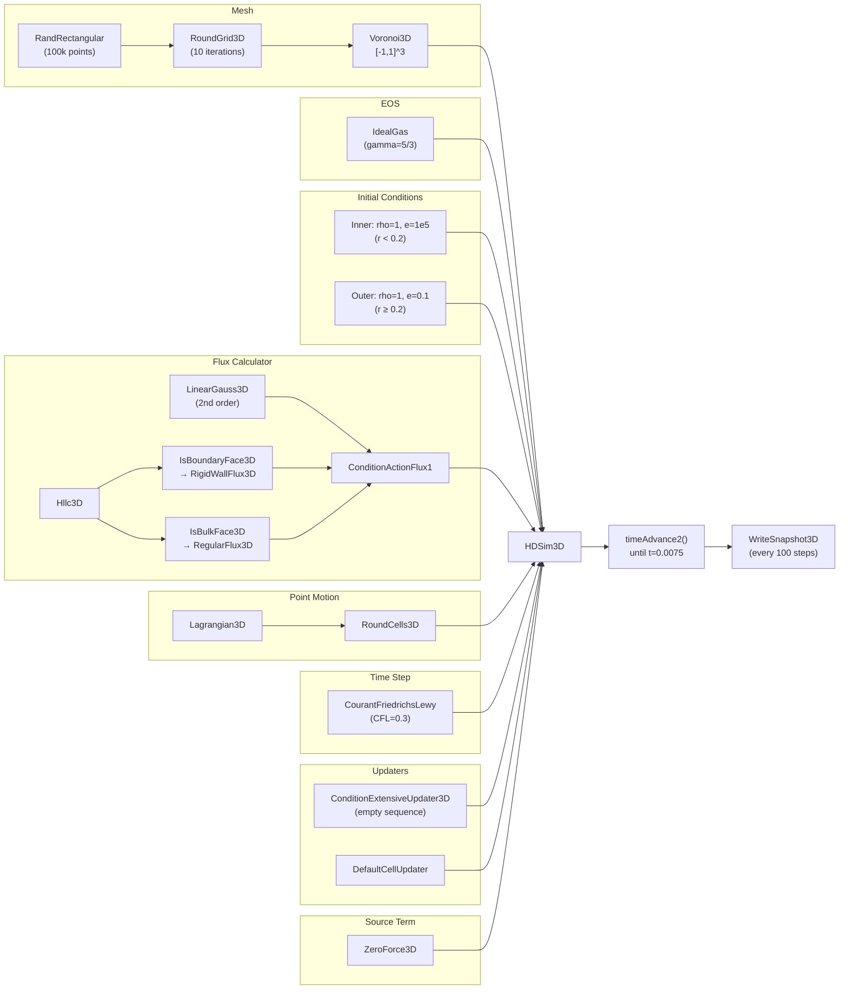

# Example: 3D Sedov Blast Wave (Fully Documented)

This page provides a complete, line-by-line walkthrough of the Sedov 3D blast wave simulation in `runs/sedov_3d/main.cpp`. Every line of the source code is explained: what it does, why it is needed, and how it connects to RICH's architecture (see [Code Architecture](Code-Architecture)).

## Table of Contents

- [Physics Background](#physics-background)
- [Complete Source Code](#complete-source-code)
- [Line-by-Line Walkthrough](#line-by-line-walkthrough)
  - [1. Header Includes](#1-header-includes)
  - [2. Constants and Domain](#2-constants-and-domain)
  - [3. MPI Initialization](#3-mpi-initialization)
  - [4. Mesh Point Generation](#4-mesh-point-generation)
  - [5. Mesh Smoothing](#5-mesh-smoothing)
  - [6. Tessellation Build](#6-tessellation-build)
  - [7. Equation of State](#7-equation-of-state)
  - [8. Initial Conditions](#8-initial-conditions)
  - [9. Riemann Solver](#9-riemann-solver)
  - [10. Ghost Cell Generator](#10-ghost-cell-generator)
  - [11. Spatial Reconstruction](#11-spatial-reconstruction)
  - [12. Flux Calculator (Condition-Action)](#12-flux-calculator-condition-action)
  - [13. Extensive Updater](#13-extensive-updater)
  - [14. Cell Updater](#14-cell-updater)
  - [15. Source Term](#15-source-term)
  - [16. Time Step Function](#16-time-step-function)
  - [17. Point Motion](#17-point-motion)
  - [18. HDSim3D Construction](#18-hdsim3d-construction)
  - [19. Time Loop](#19-time-loop)
  - [20. Final Output and MPI Cleanup](#20-final-output-and-mpi-cleanup)
- [Build and Run](#build-and-run)
- [Output Analysis](#output-analysis)
- [Expected Results](#expected-results)
- [Component Summary Diagram](#component-summary-diagram)

---

## Physics Background

The **Sedov-Taylor blast wave** is a classical self-similar solution to the Euler equations. A finite amount of energy \(E\) is deposited instantaneously at the origin of a uniform medium with density \(\rho_0\). This drives a spherical shock wave that expands outward. The shock radius evolves as:

\[
R_s(t) = \xi_0 \left( \frac{E t^2}{\rho_0} \right)^{1/5}
\]

where \(\xi_0\) is a dimensionless constant that depends on the adiabatic index \(\gamma\). For \(\gamma = 5/3\) (monatomic ideal gas), the post-shock density jump is exactly 4x the ambient value, and the solution is characterized by a thin dense shell at the shock front with a rarefied interior.

This problem is a standard test for hydrodynamics codes because it has an exact analytical solution, involves a strong shock, and tests the code's ability to handle spherical symmetry on an unstructured mesh.

---

## Complete Source Code

This is the full `runs/sedov_3d/main.cpp` with no modifications:

```cpp
#include "source/3D/tessellation/voronoi/Voronoi3D.hpp"
#include "source/3D/output/write3D.hpp"
#include "source/3D/GeometryCommon/RoundGrid3D.hpp"
#include "source/newtonian/three_dimensional/RoundCells3D.hpp"
#include "source/newtonian/three_dimensional/Lagrangian3D.hpp"
#include "source/newtonian/three_dimensional/eulerian_3d.hpp"
#include "source/newtonian/three_dimensional/default_cell_updater.hpp"
#include "source/newtonian/three_dimensional/default_extensive_updater.hpp"
#include "source/newtonian/three_dimensional/hdsim_3d.hpp"
#include "source/newtonian/three_dimensional/Hllc3D.hpp"
#include "source/newtonian/three_dimensional/LinearGauss3D.hpp"
#include "source/newtonian/three_dimensional/ConditionActionFlux1.hpp"
#include "source/newtonian/three_dimensional/ConditionExtensiveUpdater3D.hpp"
#include "source/newtonian/three_dimensional/CourantFriedrichsLewy.hpp"
#include "source/newtonian/three_dimensional/ConservativeForce3D.hpp"
#include "source/misc/mesh_generator3D.hpp"
#include "source/3D/GeometryCommon/RoundGrid3D.hpp"
#include "source/newtonian/common/ideal_gas.hpp"

int main(void)
{
    size_t const Np = 1e5;
    Vector3D ll(-1, -1, -1), ur(1, 1, 1);
    int rank = 0;
#ifdef RICH_MPI
	MPI_Init(NULL, NULL);
	MPI_Comm_rank(MPI_COMM_WORLD, &rank);
#endif

    std::vector<Vector3D> points;
    if(rank == 0)
        points = RandRectangular(Np, ll, ur);
#ifdef RICH_MPI
    points = MPI_Spread(points, 0, MPI_COMM_WORLD);
#endif
    try
    {
        points = RoundGrid3D(points, ll, ur, 10);
    }
    catch(UniversalError const& e)
    {
        reportError(e);
        throw;
    }

    if (rank == 0)
		std::cout << "Done round" << std::endl;

    Voronoi3D tess(ll, ur);
#ifdef RICH_MPI
    tess.BuildParallel(points);
#else
    tess.Build(points);
#endif

    IdealGas eos(5./3.);

    size_t const Nlocal = tess.GetPointNo();
    std::vector<ComputationalCell3D> cells(Nlocal);
    ComputationalCell3D inner_cell, outer_cell;
    inner_cell.velocity = Vector3D(0, 0 , 0);
    inner_cell.density = 1;
    inner_cell.internal_energy = 1e5;
    inner_cell.pressure = eos.de2p(inner_cell.density, inner_cell.internal_energy, inner_cell.tracers, ComputationalCell3D::tracerNames);
    outer_cell.velocity = Vector3D(0, 0 , 0);
    outer_cell.density = 1;
    outer_cell.internal_energy = 0.1;
    outer_cell.pressure = eos.de2p(outer_cell.density, outer_cell.internal_energy, outer_cell.tracers, ComputationalCell3D::tracerNames);
    for(size_t i = 0; i < Nlocal; ++i)
    {
        if(abs(tess.GetMeshPoint(i)) < 0.2)
            cells[i] = inner_cell;
        else
            cells[i] = outer_cell;
    }

	Hllc3D rs;

    RigidWallGenerator3D ghost;

	LinearGauss3D interp(eos, ghost);

	std::vector<pair<const ConditionActionFlux1::Condition3D*,
		const ConditionActionFlux1::Action3D*> > sequence;

    ConditionActionFlux1::Condition3D* isbulk = new IsBulkFace3D();
	ConditionActionFlux1::Condition3D* isboundary = new IsBoundaryFace3D();
    ConditionActionFlux1::Action3D* normal_flux = new RegularFlux3D(rs);
	ConditionActionFlux1::Action3D* rigid_flux = new RigidWallFlux3D(rs);
    sequence.push_back(std::pair<const ConditionActionFlux1::Condition3D*,
		const ConditionActionFlux1::Action3D*>(isboundary, rigid_flux));
    sequence.push_back(std::pair<const ConditionActionFlux1::Condition3D*,
		const ConditionActionFlux1::Action3D*>(isbulk, normal_flux));
	ConditionActionFlux1 flux(sequence, interp);

	std::vector<std::pair<const ConditionExtensiveUpdater3D::Condition3D*, const ConditionExtensiveUpdater3D::Action3D*> > eu_sequence;
	ConditionExtensiveUpdater3D eu(eu_sequence);

	DefaultCellUpdater cu;

	ZeroForce3D force;

	double const hydro_cfl = 0.3;
	double const force_cfl = 1;
	CourantFriedrichsLewy tsf(hydro_cfl, force_cfl, force);

	Lagrangian3D bpm;
    RoundCells3D pm(bpm, eos);

	HDSim3D sim(tess, cells, eos, pm, tsf, flux, cu, eu, force, std::make_pair(ComputationalCell3D::tracerNames, ComputationalCell3D::stickerNames));

    double old_time = sim.getTime();
    while(sim.getTime() < 0.0075)
    {
        try
        {
            if(rank == 0)
            {
                std::cout<<std::endl;
                std::cout<<"Iteration "<<sim.getCycle()<<" dt "<<sim.getTime() - old_time<<" time "<<sim.getTime()<<std::endl;
            }
            old_time = sim.getTime();
            if(sim.getCycle() % 100 == 0)
                WriteSnapshot3D(sim, "sedov_"+std::to_string(sim.getCycle())+".h5");
            sim.timeAdvance2();
        }
        catch(UniversalError const& eo)
        {
            reportError(eo);
            throw;
        }
    }
    WriteSnapshot3D(sim, "sedov_final.h5");
#ifdef RICH_MPI
    MPI_Finalize();
#endif
    return 0;
}
```

---

## Line-by-Line Walkthrough

### 1. Header Includes

```cpp
#include "source/3D/tessellation/voronoi/Voronoi3D.hpp"
```

Provides `Voronoi3D`, the concrete implementation of `Tessellation3D`. This is the 3D Voronoi mesh -- the spatial discretization that defines cells, faces, volumes, and neighbor relationships.

```cpp
#include "source/3D/output/write3D.hpp"
```

Provides `WriteSnapshot3D()`, the function that writes the simulation state to an HDF5 file. Each snapshot contains cell positions, density, pressure, velocity, internal energy, temperature, volume, radiation fields, tracers, stickers, time, and cycle number.

```cpp
#include "source/3D/GeometryCommon/RoundGrid3D.hpp"
```

Provides `RoundGrid3D()`, a mesh-smoothing function that performs Lloyd iterations (move each point to its cell's center of mass, rebuild the tessellation, repeat). This produces more regular Voronoi cells from a random point distribution.

```cpp
#include "source/newtonian/three_dimensional/RoundCells3D.hpp"
```

Provides `RoundCells3D`, a `PointMotion3D` implementation that wraps another point-motion scheme (typically `Lagrangian3D`) and adds a correction that steers mesh points toward their cell's center of mass each time step. This is the ALE (Arbitrary Lagrangian-Eulerian) approach from Springel (2010).

```cpp
#include "source/newtonian/three_dimensional/Lagrangian3D.hpp"
```

Provides `Lagrangian3D`, a `PointMotion3D` implementation where each mesh point moves with the local fluid velocity. This is the base motion used by `RoundCells3D`.

```cpp
#include "source/newtonian/three_dimensional/eulerian_3d.hpp"
```

Provides `Eulerian3D`, a `PointMotion3D` implementation where mesh points do not move (static mesh). Included here but not used in this example.

```cpp
#include "source/newtonian/three_dimensional/default_cell_updater.hpp"
```

Provides `DefaultCellUpdater`, the standard `CellUpdater3D` implementation that converts conserved (extensive) quantities back to primitive variables using the EOS after each time step.

```cpp
#include "source/newtonian/three_dimensional/default_extensive_updater.hpp"
```

Provides `DefaultExtensiveUpdater`, a basic `ExtensiveUpdater3D`. Included but not directly used -- this example uses `ConditionExtensiveUpdater3D` instead.

```cpp
#include "source/newtonian/three_dimensional/hdsim_3d.hpp"
```

Provides `HDSim3D`, the main simulation object that ties all components together and drives the time evolution. Also pulls in `ComputationalCell3D`, `Conserved3D`, and `ProgressTracker`.

```cpp
#include "source/newtonian/three_dimensional/Hllc3D.hpp"
```

Provides `Hllc3D`, the HLLC (Harten-Lax-van Leer-Contact) approximate Riemann solver in 3D. This computes the numerical flux at each cell interface.

```cpp
#include "source/newtonian/three_dimensional/LinearGauss3D.hpp"
```

Provides `LinearGauss3D`, the second-order spatial reconstruction scheme. It computes cell gradients and reconstructs left/right states at each face for the Riemann solver. Also pulls in `Ghost3D` and its implementations (`RigidWallGenerator3D`, etc.).

```cpp
#include "source/newtonian/three_dimensional/ConditionActionFlux1.hpp"
```

Provides `ConditionActionFlux1`, the condition-action flux calculator and its condition/action classes (`IsBulkFace3D`, `IsBoundaryFace3D`, `RegularFlux3D`, `RigidWallFlux3D`, etc.).

```cpp
#include "source/newtonian/three_dimensional/ConditionExtensiveUpdater3D.hpp"
```

Provides `ConditionExtensiveUpdater3D`, the condition-action extensive updater. Allows per-cell overrides during flux integration.

```cpp
#include "source/newtonian/three_dimensional/CourantFriedrichsLewy.hpp"
```

Provides `CourantFriedrichsLewy`, the CFL-based time step calculator.

```cpp
#include "source/newtonian/three_dimensional/ConservativeForce3D.hpp"
```

Provides `ConservativeForce3D` and `ZeroForce3D` (both are `SourceTerm3D` implementations). Also provides `Acceleration3D` and `ConstantAcceleration3D`. `ZeroForce3D` is the one actually used here.

```cpp
#include "source/misc/mesh_generator3D.hpp"
```

Provides mesh generation functions: `RandRectangular()`, `RandSphereR()`, `CartesianMesh()`, etc.

```cpp
#include "source/newtonian/common/ideal_gas.hpp"
```

Provides `IdealGas`, the gamma-law ideal gas `EquationOfState` implementation.

---

### 2. Constants and Domain

```cpp
int main(void)
{
    size_t const Np = 1e5;
```

**`Np = 100,000`**: The total number of mesh-generating points (and thus Voronoi cells). This determines the spatial resolution. More points = finer mesh = better resolution but longer runtime. For production runs, 10^5 to 10^7 is typical.

```cpp
    Vector3D ll(-1, -1, -1), ur(1, 1, 1);
```

**`ll` and `ur`**: The lower-left and upper-right corners of the 3D rectangular domain. This defines a cube from (-1,-1,-1) to (1,1,1), centered at the origin. The blast wave will expand within this box.

```cpp
    int rank = 0;
```

**`rank`**: MPI rank of the current process. Initialized to 0 so that in serial (non-MPI) builds, all rank-0-only operations (like generating initial points and printing) execute correctly.

---

### 3. MPI Initialization

```cpp
#ifdef RICH_MPI
    MPI_Init(NULL, NULL);
    MPI_Comm_rank(MPI_COMM_WORLD, &rank);
#endif
```

When compiled with the `RICH_MPI` define (any MPI build configuration), this initializes the MPI runtime and queries the rank of the current process. In serial builds, this block is skipped entirely and `rank` stays 0.

`MPI_Init` must be called before any other MPI function. `MPI_Comm_rank` retrieves the rank number (0, 1, 2, ...) used to partition work.

---

### 4. Mesh Point Generation

```cpp
    std::vector<Vector3D> points;
    if(rank == 0)
        points = RandRectangular(Np, ll, ur);
```

**`RandRectangular(Np, ll, ur)`**: Generates `Np` random 3D points uniformly distributed inside the box `[ll, ur]`. This is only done on rank 0 to ensure all processes start with the same set of points (important for reproducibility and correct domain decomposition).

In serial mode (`rank == 0` always), this simply populates the `points` vector. In MPI mode, only rank 0 gets the points; other ranks have an empty vector at this point.

```cpp
#ifdef RICH_MPI
    points = MPI_Spread(points, 0, MPI_COMM_WORLD);
#endif
```

**`MPI_Spread`**: Broadcasts the point set from rank 0 to all MPI ranks. After this call, every process has the full set of `Np` points. The subsequent `BuildParallel` call will partition them across processes using domain decomposition.

---

### 5. Mesh Smoothing

```cpp
    try
    {
        points = RoundGrid3D(points, ll, ur, 10);
    }
    catch(UniversalError const& e)
    {
        reportError(e);
        throw;
    }
```

**`RoundGrid3D(points, ll, ur, 10)`**: Performs 10 iterations of Lloyd's algorithm to smooth the random point distribution:

1. Build a Voronoi tessellation from the current points.
2. Move each point to its cell's center of mass.
3. Rebuild the tessellation.
4. Repeat for 10 iterations.

The result is a quasi-uniform point distribution where Voronoi cells are approximately equal-sized and roughly spherical. Starting from random points without this step would give very irregularly shaped cells, which degrades numerical accuracy and can cause robustness issues.

The `try/catch` block catches `UniversalError` exceptions that can occur if the tessellation construction fails (e.g., degenerate point configurations). `reportError(e)` prints diagnostic information including which point or cell caused the problem.

```cpp
    if (rank == 0)
        std::cout << "Done round" << std::endl;
```

Progress message printed only by rank 0 (avoids duplicate output in MPI runs).

---

### 6. Tessellation Build

```cpp
    Voronoi3D tess(ll, ur);
```

**`Voronoi3D(ll, ur)`**: Creates a `Voronoi3D` tessellation object for the domain bounded by `ll` and `ur`. The constructor stores the bounding box but does not build the mesh yet -- that happens in the `Build` or `BuildParallel` call below.

```cpp
#ifdef RICH_MPI
    tess.BuildParallel(points);
#else
    tess.Build(points);
#endif
```

**`Build(points)`** (serial): Constructs the full Voronoi tessellation from the given points. Internally, this first builds a Delaunay triangulation (`Delaunay3D`) and then dualizes it to obtain the Voronoi diagram. After this call, the tessellation provides cell volumes, face areas, neighbor relationships, and all geometric queries.

**`BuildParallel(points)`** (MPI): Constructs a distributed Voronoi tessellation. The points are partitioned across MPI ranks using a space-filling curve (Hilbert curve by default). Each rank builds its local tessellation plus a layer of ghost cells from neighboring ranks. Ghost cells are needed for flux computation across process boundaries.

---

### 7. Equation of State

```cpp
    IdealGas eos(5./3.);
```

**`IdealGas(5./3.)`**: Creates an ideal gas equation of state with adiabatic index \(\gamma = 5/3\). This is appropriate for a monatomic ideal gas. The key relationships are:

- Pressure: \(P = (\gamma - 1) \rho e\)
- Sound speed: \(c_s = \sqrt{\gamma P / \rho}\)
- Where \(e\) is the specific internal energy and \(\rho\) is the density.

For the Sedov problem, \(\gamma = 5/3\) gives a post-shock compression ratio of 4 (strong-shock limit).

---

### 8. Initial Conditions

```cpp
    size_t const Nlocal = tess.GetPointNo();
```

**`GetPointNo()`**: Returns the number of **local** cells (not including ghost cells). In serial mode this equals `Np`. In MPI mode, each rank has a subset.

```cpp
    std::vector<ComputationalCell3D> cells(Nlocal);
```

Allocates one `ComputationalCell3D` for each local cell. Each cell stores primitive variables: density, pressure, internal_energy, velocity, temperature, tracers, and stickers.

```cpp
    ComputationalCell3D inner_cell, outer_cell;
```

Defines two prototype cells: one for the high-energy inner region (the "explosion") and one for the low-energy ambient medium.

```cpp
    inner_cell.velocity = Vector3D(0, 0 , 0);
    inner_cell.density = 1;
    inner_cell.internal_energy = 1e5;
    inner_cell.pressure = eos.de2p(inner_cell.density, inner_cell.internal_energy,
                                    inner_cell.tracers, ComputationalCell3D::tracerNames);
```

**Inner cell** (the explosion region):
- **velocity = (0,0,0)**: The gas starts at rest.
- **density = 1**: Uniform density everywhere (same as ambient).
- **internal_energy = 100,000**: Very high specific internal energy. This is where the blast energy is deposited.
- **pressure**: Computed from the EOS via `de2p` (density + energy to pressure). For an ideal gas: \(P = (\gamma - 1) \rho e = (2/3)(1)(10^5) \approx 66,667\). The pressure must be computed from the EOS rather than set directly, to ensure thermodynamic consistency.

```cpp
    outer_cell.velocity = Vector3D(0, 0 , 0);
    outer_cell.density = 1;
    outer_cell.internal_energy = 0.1;
    outer_cell.pressure = eos.de2p(outer_cell.density, outer_cell.internal_energy,
                                    outer_cell.tracers, ComputationalCell3D::tracerNames);
```

**Outer cell** (ambient medium):
- **velocity = (0,0,0)**: At rest.
- **density = 1**: Same as inner region.
- **internal_energy = 0.1**: Very low energy. The pressure ratio between inner and outer regions is 10^5/0.1 = 10^6, creating an extremely strong blast.

```cpp
    for(size_t i = 0; i < Nlocal; ++i)
    {
        if(abs(tess.GetMeshPoint(i)) < 0.2)
            cells[i] = inner_cell;
        else
            cells[i] = outer_cell;
    }
```

**Assignment loop**: For each cell, check whether its mesh-generating point is within radius 0.2 from the origin. `abs(tess.GetMeshPoint(i))` computes the Euclidean distance \(\sqrt{x^2 + y^2 + z^2}\) of the mesh point from the origin.

- **r < 0.2**: Assign high-energy inner state (the explosion).
- **r >= 0.2**: Assign low-energy outer state (ambient medium).

The blast energy is distributed over all cells within the inner sphere rather than deposited in a single point. The total deposited energy is approximately \(E \approx N_{\text{inner}} \cdot V_{\text{cell}} \cdot \rho \cdot e_{\text{inner}}\).

---

### 9. Riemann Solver

```cpp
    Hllc3D rs;
```

**`Hllc3D()`**: Creates an HLLC Riemann solver with the default constructor (gamma = -1, meaning it uses the EOS for sound speed calculations rather than assuming a fixed gamma). HLLC is an approximate Riemann solver that resolves the contact discontinuity in addition to the two shock/rarefaction waves, making it well-suited for the Sedov problem which has both a shock and a contact surface.

---

### 10. Ghost Cell Generator

```cpp
    RigidWallGenerator3D ghost;
```

**`RigidWallGenerator3D`**: A `Ghost3D` implementation for rigid-wall boundary conditions. When the `LinearGauss3D` reconstruction needs values outside the domain (for cells adjacent to the boundary), this generator creates a ghost cell by:

- **Reflecting** the velocity component normal to the boundary (so fluid bounces off the wall).
- **Copying** all other primitives (density, pressure, energy) from the interior cell.

This models the domain boundary as a solid, impenetrable wall. For the Sedov problem, the blast wave will reflect off the walls once it reaches them (though the simulation typically ends before that happens).

---

### 11. Spatial Reconstruction

```cpp
    LinearGauss3D interp(eos, ghost);
```

**`LinearGauss3D(eos, ghost)`**: Creates a second-order spatial reconstruction scheme. All other parameters take their defaults:

| Parameter | Default | Meaning |
|-----------|---------|---------|
| `slf` | `true` | Slope limiting is enabled (prevents overshoots near discontinuities) |
| `delta_v` | `0.2` | Velocity slope limiter parameter |
| `theta` | `0.5` | Generalized minmod parameter (most conservative/diffusive setting) |
| `delta_P` | `0.7` | Pressure slope limiter parameter |

**How it works:** For each face, `LinearGauss3D` computes the gradient of every primitive variable in the cells on both sides. It then reconstructs left and right states at the face center by extrapolating from the cell center: \(q_L = q_C + \nabla q \cdot (x_{\text{face}} - x_C)\). The slope limiter prevents the reconstructed values from exceeding the range of neighboring cell values, which is essential for stability near shocks.

The `eos` reference is needed because the reconstruction enforces EOS consistency (the reconstructed pressure matches what the EOS would give for the reconstructed density and energy). The `ghost` generator is needed to create boundary ghost cells for the gradient computation.

---

### 12. Flux Calculator (Condition-Action)

This is the most complex setup section. It builds a condition-action sequence that tells the flux calculator how to handle each face in the mesh.

```cpp
    std::vector<pair<const ConditionActionFlux1::Condition3D*,
        const ConditionActionFlux1::Action3D*> > sequence;
```

Creates an empty sequence of (condition, action) pairs.

```cpp
    ConditionActionFlux1::Condition3D* isbulk = new IsBulkFace3D();
    ConditionActionFlux1::Condition3D* isboundary = new IsBoundaryFace3D();
```

Creates two condition objects:
- **`IsBulkFace3D`**: Returns `true` when both cells sharing a face are interior cells (not boundary ghosts).
- **`IsBoundaryFace3D`**: Returns `true` when one of the cells sharing a face is a boundary ghost.

```cpp
    ConditionActionFlux1::Action3D* normal_flux = new RegularFlux3D(rs);
    ConditionActionFlux1::Action3D* rigid_flux = new RigidWallFlux3D(rs);
```

Creates two action objects:
- **`RegularFlux3D(rs)`**: Computes the standard HLLC flux between two interior cells. Uses the `LinearGauss3D` reconstruction to get left/right states, then calls the Riemann solver.
- **`RigidWallFlux3D(rs)`**: Computes the flux at a rigid wall. Reflects the velocity normal to the boundary and solves the Riemann problem against the reflected state.

```cpp
    sequence.push_back(std::pair<const ConditionActionFlux1::Condition3D*,
        const ConditionActionFlux1::Action3D*>(isboundary, rigid_flux));
    sequence.push_back(std::pair<const ConditionActionFlux1::Condition3D*,
        const ConditionActionFlux1::Action3D*>(isbulk, normal_flux));
```

**Adds the pairs to the sequence. Order matters.** For each face, the conditions are checked in order:

1. **First: Is it a boundary face?** If yes, apply rigid-wall flux.
2. **Second: Is it a bulk face?** If yes, apply regular HLLC flux.

Boundary faces are checked first because a boundary face would also match `IsBulkFace3D` if checked second (since the flux calculator stops at the first matching condition). Putting boundary conditions first ensures they take priority.

```cpp
    ConditionActionFlux1 flux(sequence, interp);
```

**`ConditionActionFlux1(sequence, interp)`**: Creates the flux calculator. It stores the condition-action sequence and the spatial reconstruction scheme. During each time step, for every face in the mesh:

1. `interp` reconstructs left/right primitive states at the face.
2. The first matching condition in `sequence` selects the action.
3. The action computes the conserved flux across the face.

---

### 13. Extensive Updater

```cpp
    std::vector<std::pair<const ConditionExtensiveUpdater3D::Condition3D*,
        const ConditionExtensiveUpdater3D::Action3D*> > eu_sequence;
    ConditionExtensiveUpdater3D eu(eu_sequence);
```

Creates a `ConditionExtensiveUpdater3D` with an **empty** condition-action sequence. This means no special per-cell overrides are applied during flux integration -- every cell gets the standard update: sum fluxes over all faces, multiply by dt and face area, and add/subtract from the conserved variables.

If you wanted to freeze certain cells (e.g., inner boundary sinks in a TDE simulation), you would add entries like `{new StickerChoose("frozen"), new NoExtensiveUpdate3D()}` to the sequence.

---

### 14. Cell Updater

```cpp
    DefaultCellUpdater cu;
```

**`DefaultCellUpdater()`**: Creates the standard cell updater with all defaults (no special relativity, no temperature computation, no radiation coupling). After each time step, for every cell it computes:

- `density = mass / volume`
- `velocity = momentum / mass`
- `internal_energy = (energy - 0.5 * mass * |velocity|^2) / mass`
- `pressure = eos.de2p(density, internal_energy, ...)`

---

### 15. Source Term

```cpp
    ZeroForce3D force;
```

**`ZeroForce3D`**: A no-op source term. Its `operator()` does nothing. This is correct for the Sedov problem because there are no external forces -- the blast wave is driven purely by the initial pressure difference. No gravity, no radiation forces.

---

### 16. Time Step Function

```cpp
    double const hydro_cfl = 0.3;
    double const force_cfl = 1;
    CourantFriedrichsLewy tsf(hydro_cfl, force_cfl, force);
```

**`CourantFriedrichsLewy(0.3, 1, force)`**: Creates a CFL-based time step calculator.

- **`hydro_cfl = 0.3`**: The hydrodynamic CFL number. For each cell, the time step satisfies \(\Delta t \le 0.3 \cdot \Delta x / (c_s + |v|)\), where \(\Delta x\) is the cell width (cube root of volume), \(c_s\) is the sound speed, and \(|v|\) is the fluid velocity. The value 0.3 is conservative and stable for second-order schemes.
- **`force_cfl = 1`**: The source-term CFL number. Since we use `ZeroForce3D`, this has no effect (zero force implies infinite source time step). The value 1 is a reasonable default.
- **`force`**: Reference to the source term, used to query `SuggestInverseTimeStep()` for source-limited dt constraints.

---

### 17. Point Motion

```cpp
    Lagrangian3D bpm;
    RoundCells3D pm(bpm, eos);
```

**`Lagrangian3D bpm`**: The base point motion scheme -- each mesh point moves with the local fluid velocity. This is the fundamental Lagrangian property: the mesh follows the flow.

**`RoundCells3D pm(bpm, eos)`**: Wraps the Lagrangian motion with a roundness correction. After computing the Lagrangian velocity for each point, `RoundCells3D` adds a correction that pushes the point toward its cell's center of mass. This prevents cells from becoming extremely elongated or distorted in regions of strong shear.

The default parameters (`chi = 1.25`, `eta = 0.02`) provide a good balance between Lagrangian accuracy and cell quality. The `eos` reference is needed to compute the local sound speed, which scales the correction velocity.

This combination (Lagrangian + RoundCells) is the standard ALE approach used in most RICH simulations.

---

### 18. HDSim3D Construction

```cpp
    HDSim3D sim(tess, cells, eos, pm, tsf, flux, cu, eu, force,
                std::make_pair(ComputationalCell3D::tracerNames,
                               ComputationalCell3D::stickerNames));
```

**This is where everything comes together.** All the components built above are passed to the `HDSim3D` constructor:

| Argument | Object | Role |
|----------|--------|------|
| `tess` | `Voronoi3D` | The mesh |
| `cells` | `vector<ComputationalCell3D>` | Initial primitive data |
| `eos` | `IdealGas(5/3)` | Thermodynamics |
| `pm` | `RoundCells3D(Lagrangian3D)` | Mesh motion (ALE) |
| `tsf` | `CourantFriedrichsLewy(0.3)` | Time step (CFL) |
| `flux` | `ConditionActionFlux1` | Flux calculator (HLLC + rigid walls) |
| `cu` | `DefaultCellUpdater` | Conserved to primitive |
| `eu` | `ConditionExtensiveUpdater3D` | Flux integration |
| `force` | `ZeroForce3D` | No external forces |
| `tsn` | `(tracerNames, stickerNames)` | Tracer/sticker field names |

Internally, the constructor also computes the initial conserved (extensive) variables from the primitives: `extensive[i] = cells[i] * volume[i]` for each cell.

---

### 19. Time Loop

```cpp
    double old_time = sim.getTime();
```

Saves the current simulation time for computing dt in the progress output.

```cpp
    while(sim.getTime() < 0.0075)
    {
```

**Main time loop.** Runs until the simulation time reaches 0.0075. At this time, the Sedov blast wave has expanded to roughly r ~ 0.5, well within the domain.

```cpp
        try
        {
```

Everything inside the loop is wrapped in a `try/catch` for robust error handling.

```cpp
            if(rank == 0)
            {
                std::cout<<std::endl;
                std::cout<<"Iteration "<<sim.getCycle()<<" dt "
                         <<sim.getTime() - old_time<<" time "<<sim.getTime()<<std::endl;
            }
            old_time = sim.getTime();
```

**Progress output** (rank 0 only): Prints the current cycle number, the time step used in the previous iteration (current time minus previous time), and the current simulation time. This lets you monitor convergence and spot problems (e.g., dt dropping to near-zero indicates a numerical issue).

```cpp
            if(sim.getCycle() % 100 == 0)
                WriteSnapshot3D(sim, "sedov_"+std::to_string(sim.getCycle())+".h5");
```

**Periodic output**: Every 100 time steps, writes an HDF5 snapshot. This produces files like `sedov_0.h5`, `sedov_100.h5`, `sedov_200.h5`, etc. Each snapshot contains the complete simulation state and can be read in Python for analysis.

```cpp
            sim.timeAdvance2();
```

**The core of the time step.** Calls the second-order (Heun) time advance method on `HDSim3D`. This performs the full sequence described in [Data Flow](Code-Architecture#data-flow-what-happens-in-a-time-step): compute point velocities, get dt from CFL, compute fluxes, update conserved quantities, apply source terms, move mesh, rebuild tessellation, update cells -- twice, then average for second-order accuracy.

```cpp
        }
        catch(UniversalError const& eo)
        {
            reportError(eo);
            throw;
        }
```

**Error handling:** If any step in `timeAdvance2()` throws a `UniversalError` (e.g., negative density, EOS failure, tessellation error), `reportError()` prints diagnostic information (the cell index, variable values, coordinates, etc.) before re-throwing. This is invaluable for debugging.

---

### 20. Final Output and MPI Cleanup

```cpp
    WriteSnapshot3D(sim, "sedov_final.h5");
```

Writes the final simulation state to `sedov_final.h5`. This is the file you analyze to check the blast wave profile.

```cpp
#ifdef RICH_MPI
    MPI_Finalize();
#endif
    return 0;
}
```

**`MPI_Finalize()`**: Shuts down the MPI runtime (required at the end of every MPI program). In serial builds, this is skipped.

**`return 0`**: Clean exit.

---

## Build and Run

### Serial Build

```bash
./build_rich.sh gnuRelease --test_name=sedov_3d
```

### MPI Build

```bash
ml openmpi/4.1.6/Intel/OneApi/2024.2.1
./build_rich.sh gnuReleaseMPI --test_name=sedov_3d
```

### Serial Execution

```bash
cd runs/sedov_3d
../../build/gnuRelease/rich
```

### MPI Execution (via SLURM)

```bash
cd runs/sedov_3d
sbatch --wait --exclusive --partition=bigrun --ntasks=128 \
  --output=output_%j --error=error_%j \
  --wrap "mpirun -np 128 ../../build/gnuReleaseMPI/rich"
```

### Via Regression Framework

A smaller version of this test (fewer particles, fewer cycles) runs as part of the regression suite:

```bash
./regression_tests/run_all.sh --test sedov_3d_mpi --verbose --keep-artifacts
```

---

## Output Analysis

### Read HDF5 in Python

```python
import h5py
import numpy as np
import matplotlib.pyplot as plt

with h5py.File("runs/sedov_3d/sedov_final.h5", "r") as f:
    x = f["X"][:]           # mesh-point x coordinates
    y = f["Y"][:]           # mesh-point y coordinates
    z = f["Z"][:]           # mesh-point z coordinates
    density = f["Density"][:]
    pressure = f["Pressure"][:]
    vx = f["Vx"][:]
    vy = f["Vy"][:]
    vz = f["Vz"][:]
    volume = f["Volume"][:]
    time = f["Time"][()]     # scalar

r = np.sqrt(x**2 + y**2 + z**2)
v = np.sqrt(vx**2 + vy**2 + vz**2)
```

### Plot Density Profile

```python
fig, axes = plt.subplots(1, 3, figsize=(15, 4))

axes[0].scatter(r, density, s=0.1, alpha=0.3)
axes[0].set_xlabel("Radius")
axes[0].set_ylabel("Density")
axes[0].set_title("Density vs Radius")

axes[1].scatter(r, pressure, s=0.1, alpha=0.3)
axes[1].set_xlabel("Radius")
axes[1].set_ylabel("Pressure")
axes[1].set_title("Pressure vs Radius")

axes[2].scatter(r, v, s=0.1, alpha=0.3)
axes[2].set_xlabel("Radius")
axes[2].set_ylabel("Velocity magnitude")
axes[2].set_title("Velocity vs Radius")

plt.suptitle(f"Sedov Blast Wave at t = {time:.5f}")
plt.tight_layout()
plt.savefig("sedov_profile.png", dpi=150)
plt.show()
```

### Compare with Analytical Solution

```python
import sys
sys.path.insert(0, "analytic")
from sedov_taylor import SedovTaylor

gamma = 5./3.
sedov = SedovTaylor(gamma=gamma, geometry=3)

# Compute the total deposited energy
inner_mask = r < 0.2
E_total = np.sum(density[inner_mask] * 1e5 * volume[inner_mask])

# Exact solution at a set of radii
r_exact = np.linspace(0.01, 1.0, 1000)
rho_exact, p_exact, v_exact = sedov.solve(r_exact, time, E_total, rho_ambient=1.0)

fig, axes = plt.subplots(1, 3, figsize=(15, 4))
for ax, sim_data, exact_data, label in zip(
    axes,
    [density, pressure, v],
    [rho_exact, p_exact, v_exact],
    ["Density", "Pressure", "Velocity"]
):
    ax.scatter(r, sim_data, s=0.1, alpha=0.2, label="RICH")
    ax.plot(r_exact, exact_data, "r-", linewidth=2, label="Exact")
    ax.set_xlabel("Radius")
    ax.set_ylabel(label)
    ax.legend()

plt.tight_layout()
plt.savefig("sedov_comparison.png", dpi=150)
plt.show()
```

---

## Expected Results

At t = 0.0075, the blast wave should show:

- **Sharp shock front** at r ~ 0.5 (depends on the total deposited energy and gamma).
- **Post-shock density jump** of 4x the ambient value (strong-shock limit for gamma = 5/3): density rises from 1 to 4 at the shock.
- **Thin dense shell** just behind the shock front, with a rarefied interior (density drops to near zero at the center).
- **Pressure peak** at the shock front, decaying inward.
- **Velocity profile** rising from zero at the center to a maximum just behind the shock, then dropping to zero in the ambient medium.
- **Spherical symmetry** should be well-preserved despite the unstructured Voronoi mesh; scatter in the radial profiles should be small.

---

## Component Summary Diagram

This diagram shows how all the components in the Sedov example connect:


